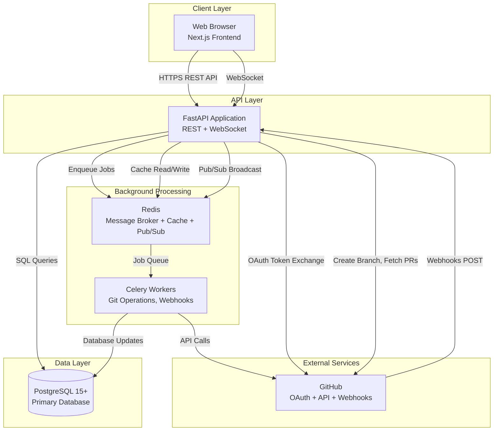

# Taskly Backend Architecture Document

## Introduction

This document outlines the overall project architecture for **Taskly**, including backend systems, shared services, and non-UI specific concerns. Its primary goal is to serve as the guiding architectural blueprint for AI-driven development, ensuring consistency and adherence to chosen patterns and technologies.

**Relationship to Frontend Architecture:**
If the project includes a significant user interface, a separate Frontend Architecture Document will detail the frontend-specific design and MUST be used in conjunction with this document. Core technology stack choices documented herein (see "Tech Stack") are definitive for the entire project, including any frontend components.

### Starter Template Decision

**Backend (FastAPI):** No starter template - manual setup from scratch
- Rationale: FastAPI is minimal by design; PRD specifies custom architecture (async SQLAlchemy 2.0, Celery, FastAPI WebSockets). Manual setup gives full control without unnecessary boilerplate.

**Frontend:** Deferred to separate Frontend Architecture Document (out of scope for backend architecture)

**Monorepo:** npm workspaces (simple, built-in, sufficient for MVP)

### Change Log

| Date | Version | Description | Author |
|------|---------|-------------|--------|
| 2025-10-23 | 1.0 | Initial backend architecture draft | Winston (Architect Agent) |

---

## High Level Architecture

### Technical Summary

Taskly employs a **monolithic API architecture** with a separate background job queue, deployed as a containerized application using Docker. The backend is built on **FastAPI (Python 3.11+)** with **async SQLAlchemy 2.0** for database operations and **Celery + Redis** for asynchronous task processing. The system integrates tightly with **GitHub via OAuth 2.0 and webhooks**, enabling bidirectional synchronization between project boards and Git repositories. Real-time collaboration is powered by **FastAPI WebSockets** with Redis pub/sub for multi-instance coordination. This architecture directly supports the PRD's core goal: treating the project board as a "control surface for your repo" by automating Git workflows (branch creation, PR linking) and reflecting code activity (commits, CI status, merges) on cards in real-time, eliminating double-entry work and preserving task-to-code context.

### High Level Overview

**1. Architectural Style: Monolithic API with Job Queue Separation**

Per PRD Technical Assumptions, we're using a **single FastAPI application** handling all REST endpoints and WebSocket connections, with **Celery workers** processing long-running tasks asynchronously. This avoids premature microservices complexity while maintaining non-blocking API responses for Git operations.

**2. Repository Structure: Monorepo (npm workspaces)**

Single repository with `/frontend` and `/backend` directories enables atomic commits, simplified CI/CD, and reduced context switching for the small team (1-3 developers).

**3. Service Architecture Components:**
- **FastAPI API Server:** REST endpoints, WebSocket server, synchronous request handling
- **Celery Workers:** Git operations (branch creation, webhook processing), bulk updates, email notifications
- **PostgreSQL 15+:** Primary data store (relational data + JSONB for flexible metadata)
- **Redis:** Celery message broker, session storage, caching layer, WebSocket pub/sub

**4. Primary User/Data Flow:**
- User authenticates via GitHub OAuth → JWT tokens issued
- User manipulates cards on board (drag-and-drop, edit) → FastAPI API updates PostgreSQL → WebSocket broadcasts changes
- User clicks "Create Branch" → FastAPI enqueues Celery job → Celery worker calls GitHub API → Card updated with branch link
- GitHub webhook fires (PR merged) → FastAPI validates, enqueues job → Celery processes → Card auto-moved to Done → WebSocket notifies users

**5. Key Architectural Decisions:**

| Decision | Rationale |
|----------|-----------|
| **Monolith over Microservices** | PRD targets <10k users; monolith simpler to develop/debug/deploy. Scale vertically first. |
| **Celery for async jobs** | GitHub API calls can take 1-3s; offloading to workers keeps API responsive (<200ms). |
| **PostgreSQL (not NoSQL)** | JSONB provides flexibility, but relational model fits boards/cards/users better. ACID transactions critical for Git sync. |
| **FastAPI WebSockets** | Integrated solution; no need for separate Socket.IO server. Falls back to polling if needed. |
| **Redis for multiple concerns** | Consolidated infrastructure: message broker + cache + pub/sub reduces operational complexity. |

### High Level Project Diagram



### Architectural and Design Patterns

**Pattern Selection Rationale:** These patterns align with PRD goals (Git-native sync, real-time collaboration, developer productivity) and the chosen tech stack.

**1. Repository Pattern**
- **Description:** Abstract data access logic behind repository interfaces (`CardRepository`, `WorkspaceRepository`, etc.)
- **Implementation:** SQLAlchemy 2.0 async sessions wrapped in repository classes
- **Rationale:** Enables unit testing with mock repositories, isolates ORM concerns from business logic, makes future database migrations easier.
- **Example:** `CardRepository.get_by_id(card_id)` instead of direct `session.query(Card).filter_by(id=card_id)`

**2. Service Layer Pattern**
- **Description:** Business logic lives in service classes (`CardService`, `GitIntegrationService`), not in API route handlers
- **Implementation:** Services injected into FastAPI dependencies
- **Rationale:** Keeps route handlers thin (validation + serialization only), reusable logic across API and Celery tasks, easier testing.
- **Example:** `CardService.move_card(card_id, target_column_id)` handles position recalculation, activity logging, WebSocket broadcast

**3. Background Job Pattern (Task Queue)**
- **Description:** Long-running operations executed asynchronously via Celery
- **Implementation:** Celery tasks with retry logic, idempotency keys, progress tracking
- **Rationale:** PRD requires <3s Git operations; Celery offloads work, maintains API responsiveness. Retry with exponential backoff handles GitHub API flakiness.
- **Jobs:** `create_branch_task`, `process_webhook_task`, `bulk_update_cards_task`, `send_email_task`

**4. Webhook Event Handler Pattern**
- **Description:** Idempotent webhook processors with signature validation and event routing
- **Implementation:** FastAPI endpoint validates HMAC, enqueues job with event_id deduplication
- **Rationale:** GitHub may deliver webhooks multiple times; idempotency prevents duplicate card updates. Async processing prevents webhook timeout retries.
- **Flow:** `POST /webhooks/github` → validate signature → check event_id in Redis → enqueue if new → return 200 OK

**5. Command Query Responsibility Segregation (CQRS-lite)**
- **Description:** Separate read models (queries) from write operations (commands)
- **Implementation:** Read queries hit cached data (Redis), writes invalidate cache and broadcast via WebSocket
- **Rationale:** Board views are read-heavy (users browsing cards); caching reduces database load. Writes trigger invalidation + real-time sync.
- **Example:** `GET /boards/{id}` serves cached board, `PATCH /cards/{id}` updates DB + clears cache + broadcasts

**6. Optimistic UI Pattern (Frontend-Backend Contract)**
- **Description:** Frontend applies changes immediately, backend confirms/rolls back
- **Implementation:** API returns updated entity + timestamp; WebSocket broadcasts canonical state
- **Rationale:** PRD requires <500ms UI responsiveness; optimistic updates eliminate perceived lag. Backend is source of truth.

**7. Circuit Breaker Pattern (GitHub API Resilience)**
- **Description:** Temporarily stop calling GitHub API after repeated failures
- **Implementation:** `tenacity` library with exponential backoff, max retries, circuit breaker state
- **Rationale:** GitHub API rate limits (5000 req/hr) or outages shouldn't crash Taskly. Graceful degradation: show stale data with warning.

---

## Tech Stack

### Cloud Infrastructure

- **Provider:** DigitalOcean
- **Key Services:**
  - **Compute:** DigitalOcean Droplets (Docker containers) or App Platform (PaaS)
  - **Database:** Managed PostgreSQL 15
  - **Cache:** Managed Redis
  - **Load Balancer:** DigitalOcean Load Balancer
  - **Object Storage:** Spaces (S3-compatible, for file attachments if needed later)
  - **Secrets:** Environment variables via App Platform or Droplet env config
- **Deployment Regions:** Primary: `nyc3` (New York), Fallback: `sfo3` (San Francisco)

### Technology Stack Table

| Category | Technology | Version | Purpose | Rationale |
|----------|------------|---------|---------|-----------|
| **Language** | Python | 3.11.7 | Backend development language | Type hints, async support, team familiarity, excellent FastAPI integration |
| **Runtime** | CPython | 3.11.7 | Python interpreter | Official implementation, best performance for FastAPI |
| **Package Manager** | UV | 0.1.18+ | Python dependency management | Extremely fast (10-100x faster than pip/poetry), reliable lock files, modern tool |
| **Web Framework** | FastAPI | 0.109.0 | REST API + WebSocket server | Async-native, automatic OpenAPI docs, Pydantic validation, WebSocket support |
| **ASGI Server** | Uvicorn | 0.27.0 | Production ASGI server | High performance, recommended for FastAPI, supports WebSockets |
| **Database** | PostgreSQL | 15.5 | Primary data store | JSONB flexibility, ACID transactions, full-text search, mature ORM support |
| **ORM** | SQLAlchemy | 2.0.25 | Database abstraction layer | Async support, flexible query builder, migration tools, type safety |
| **Migrations** | Alembic | 1.13.1 | Database schema versioning | Standard for SQLAlchemy, auto-generation, team workflows |
| **Cache/Broker** | Redis | 7.2.4 | Caching, Celery broker, pub/sub | Fast, supports multiple use cases, simple deployment |
| **Task Queue** | Celery | 5.3.4 | Background job processing | Mature, retry logic, monitoring tools (Flower), Redis integration |
| **Validation** | Pydantic | 2.5.3 | Data validation, serialization | Bundled with FastAPI, type-safe, excellent error messages |
| **Auth** | PyJWT | 2.8.0 | JWT token handling | Lightweight, standard JWT implementation |
| **HTTP Client** | httpx | 0.26.0 | Async HTTP (GitHub API calls) | Async-first, modern replacement for requests, timeout handling |
| **GitHub Integration** | PyGithub | 2.1.1 | GitHub API wrapper | Comprehensive API coverage, handles rate limits, type stubs available |
| **Testing Framework** | pytest | 7.4.4 | Unit and integration tests | Industry standard, async support (pytest-asyncio), extensive plugins |
| **Test Async** | pytest-asyncio | 0.23.3 | Async test support | Enables testing FastAPI async routes |
| **Test Coverage** | pytest-cov | 4.1.0 | Code coverage reporting | Integrates with pytest, generates reports for CI |
| **Linting** | Ruff | 0.1.14 | Fast Python linter | 10-100x faster than Flake8, replaces multiple tools |
| **Formatting** | Black | 24.1.1 | Code formatting | Opinionated, consistent style, team standard |
| **Type Checking** | mypy | 1.8.0 | Static type analysis | Catches type errors, enforces type hints, integrates with IDEs |
| **Logging** | structlog | 24.1.0 | Structured logging | JSON logs, contextual logging, correlation IDs, production-ready |
| **Monitoring** | Sentry SDK | 1.40.0 | Error tracking | Exception capture, performance monitoring, alerting |
| **Containerization** | Docker | 24.0.7 | Application packaging | Standard deployment, local dev parity, multi-stage builds |
| **Orchestration** | Docker Compose | 2.24.0 | Multi-container management | Local development, staging environments, simple orchestration |
| **CI/CD** | GitHub Actions | N/A | Automated testing/deployment | Native to GitHub, free for public repos, ecosystem integration |

---

## Data Models

### 1. User

**Purpose:** Represents authenticated users who access Taskly via GitHub OAuth.

**Key Attributes:**
- `id`: UUID - Primary identifier
- `github_id`: Integer - GitHub user ID (unique, from OAuth)
- `username`: String - GitHub username
- `email`: String - User email (from GitHub profile)
- `avatar_url`: String - GitHub avatar URL
- `github_access_token`: String - Encrypted OAuth token for GitHub API calls
- `created_at`: DateTime - Account creation timestamp
- `updated_at`: DateTime - Last profile update

**Relationships:**
- One user can belong to **many workspaces** (via `workspace_members` join table)
- One user can be assigned to **many cards** (via `card_assignees` join table)
- One user **creates** many cards, comments, activity entries

### 2. Workspace

**Purpose:** Top-level organizational container for boards and team collaboration.

**Key Attributes:**
- `id`: UUID - Primary identifier
- `name`: String (max 100 chars) - Workspace display name
- `created_by`: UUID - Foreign key to User (workspace creator)
- `created_at`: DateTime - Creation timestamp
- `updated_at`: DateTime - Last modification

**Relationships:**
- Belongs to **one creator** (User)
- Has **many members** (Users via `workspace_members` with roles)
- Contains **many boards**
- Has **many connected git repositories**

### 3. Board

**Purpose:** Kanban board with customizable columns for organizing cards.

**Key Attributes:**
- `id`: UUID - Primary identifier
- `workspace_id`: UUID - Foreign key to Workspace
- `name`: String (max 100 chars) - Board display name
- `columns`: JSONB - Array of column definitions: `[{id, name, position}]`
- `default_repository_id`: UUID - Optional FK to GitRepository (for branch creation)
- `archived`: Boolean - Soft delete flag
- `created_at`: DateTime
- `updated_at`: DateTime

**Relationships:**
- Belongs to **one workspace**
- Contains **many cards**
- Has **many sprints**
- May link to **one default git repository**

### 4. Card

**Purpose:** Central entity representing a task/feature with rich metadata.

**Key Attributes:**
- `id`: UUID - Primary identifier
- `board_id`: UUID - Foreign key to Board
- `column_id`: UUID - Current column (references Board.columns JSONB)
- `title`: String (max 255 chars) - Card title
- `description`: Text - Markdown description
- `metadata`: JSONB - Flexible storage: `{labels: [{id, name, color}], acceptance_criteria: "text"}`
- `priority`: Enum('none', 'low', 'medium', 'high', 'urgent') - Priority level
- `story_points`: Integer (0-99) - Estimation
- `due_date`: Date - Optional deadline
- `position`: Integer - Position within column (for ordering)
- `sprint_id`: UUID - Optional FK to Sprint (null = backlog)
- `created_by`: UUID - FK to User
- `created_at`: DateTime
- `updated_at`: DateTime

**Relationships:**
- Belongs to **one board**
- Positioned in **one column** (within board)
- Assigned to **many users** (via `card_assignees`)
- Linked to **many pull requests** (via `card_pull_requests`)
- Optionally assigned to **one sprint**
- Has **many comments**
- Has **many activity entries**

### 5. Sprint

**Purpose:** Time-boxed iteration for organizing cards and capacity planning.

**Key Attributes:**
- `id`: UUID - Primary identifier
- `board_id`: UUID - Foreign key to Board
- `name`: String - Sprint name (e.g., "Sprint 1", "v1.0 Release")
- `start_date`: Date - Sprint start
- `end_date`: Date - Sprint end
- `goal`: Text (max 500 chars) - Optional sprint goal description
- `capacity_points`: Integer - Configurable capacity (default 40 story points)
- `status`: Enum('planned', 'active', 'completed') - Calculated from dates
- `created_at`: DateTime
- `updated_at`: DateTime
- `deleted_at`: DateTime - Soft delete timestamp

**Relationships:**
- Belongs to **one board**
- Contains **many cards** (cards.sprint_id points here)

### 6. GitRepository

**Purpose:** Caches connected GitHub repository metadata.

**Key Attributes:**
- `id`: UUID - Primary identifier
- `workspace_id`: UUID - FK to Workspace
- `github_repo_id`: Integer - GitHub's repository ID (unique)
- `owner`: String - GitHub owner/org name
- `name`: String - Repository name
- `full_name`: String - owner/repo format
- `default_branch`: String - Main branch name (e.g., "main")
- `is_active`: Boolean - Soft delete flag (disconnected repos)
- `connected_at`: DateTime
- `updated_at`: DateTime

**Relationships:**
- Belongs to **one workspace**
- Has **many pull requests**
- May be default repository for **many boards**

### 7. PullRequest

**Purpose:** Caches GitHub PR data to reduce API calls and enable fast queries.

**Key Attributes:**
- `id`: UUID - Primary identifier
- `repository_id`: UUID - FK to GitRepository
- `github_pr_id`: Integer - GitHub's PR ID
- `pr_number`: Integer - PR number (e.g., #123)
- `title`: String - PR title
- `state`: Enum('open', 'closed', 'draft', 'merged') - PR state
- `author_github_id`: Integer - GitHub user ID of PR author
- `head_branch`: String - Source branch
- `base_branch`: String - Target branch
- `url`: String - GitHub PR URL
- `mergeable`: Boolean - Can be merged?
- `ci_status`: JSONB - CI check results: `{status: 'success'|'failure'|'pending', checks: [{name, status, url}]}`
- `commit_count`: Integer - Number of commits
- `last_commit_sha`: String - Latest commit SHA
- `approval_count`: Integer - Number of approving reviews
- `fetched_at`: DateTime - Last sync from GitHub
- `created_at`: DateTime
- `updated_at`: DateTime

**Relationships:**
- Belongs to **one git repository**
- Linked to **many cards** (via `card_pull_requests`)

### Additional Supporting Models

- **WorkspaceMember:** Join table linking workspaces ↔ users with roles
- **CardPullRequest:** Join table linking cards ↔ pull requests
- **CardAssignee:** Join table linking cards ↔ users (assignees)
- **CardComment:** Comments on cards
- **CardActivity:** Audit log for card changes

---

## Components

### 1. API Layer (FastAPI Routes & Middleware)

**Responsibility:** HTTP request handling, validation, serialization, and routing.

**Key Interfaces:**
- `POST /auth/github/callback` - OAuth callback handler
- `POST /auth/refresh` - Refresh JWT access token
- `GET /workspaces` - List user's workspaces
- `POST /workspaces` - Create workspace
- `GET /boards/{id}` - Fetch board with cards
- `PATCH /cards/{id}` - Update card
- `POST /cards/bulk-update` - Batch card operations
- `POST /cards/{id}/create-branch` - Trigger branch creation
- `POST /webhooks/github` - GitHub webhook receiver
- `WebSocket /ws/boards/{board_id}` - Real-time board updates

**Dependencies:**
- Service Layer (business logic delegation)
- Authentication Middleware (JWT validation)
- WebSocket Manager (real-time broadcasts)

**Technology Stack:**
- FastAPI 0.109.0 with Pydantic 2.5.3 for request/response validation
- Uvicorn 0.27.0 ASGI server
- FastAPI dependency injection for service/repository wiring
- Middleware: CORS, rate limiting, request logging, error handling

### 2. Service Layer (Business Logic)

**Responsibility:** Orchestrates business operations, enforces business rules, coordinates between repositories and external services.

**Key Interfaces:**
- `WorkspaceService.create_workspace(name, creator_id) -> Workspace`
- `CardService.move_card(card_id, target_column_id, position) -> Card`
- `CardService.bulk_update(card_ids, updates) -> List[Card]`
- `GitIntegrationService.create_branch(card_id, repo_id, branch_name) -> Task`
- `WebhookService.process_pull_request_event(payload) -> None`
- `AuthService.exchange_github_code(code) -> Tuple[access_token, refresh_token]`

**Dependencies:**
- Repository Layer (data persistence)
- GitHub Client (external API calls)
- Celery Client (job enqueueing)
- WebSocket Manager (real-time notifications)
- Cache Manager (Redis operations)

### 3. Repository Layer (Data Access)

**Responsibility:** Abstract database operations, provide clean data access interface, handle query optimization.

**Key Interfaces:**
- `CardRepository.get_by_id(card_id) -> Optional[Card]`
- `CardRepository.get_by_board(board_id, filters) -> List[Card]`
- `CardRepository.update(card_id, updates) -> Card`
- `WorkspaceRepository.get_by_user(user_id) -> List[Workspace]`
- `PullRequestRepository.get_by_card(card_id) -> List[PullRequest]`
- `PullRequestRepository.upsert_from_github(pr_data) -> PullRequest`

**Dependencies:**
- SQLAlchemy Models (ORM layer)
- Database Session (async session management)

**Technology Stack:**
- SQLAlchemy 2.0.25 (async engine + async sessions)
- Repository pattern implementation (one repository per aggregate)

### 4. Background Workers (Celery Tasks)

**Responsibility:** Execute long-running, asynchronous operations without blocking API responses.

**Key Interfaces:**
- `create_branch_task(card_id, repo_id, branch_name, base_branch)`
- `process_webhook_task(event_type, payload, event_id)`
- `bulk_update_cards_task(card_ids, updates)`
- `send_invitation_email_task(email, workspace_name, token)`
- `sync_pull_request_task(pr_id)`

**Dependencies:**
- Service Layer (reuses business logic)
- Repository Layer (database updates)
- GitHub Client (API calls)
- WebSocket Manager (broadcast updates after task completion)

**Technology Stack:**
- Celery 5.3.4 with Redis 7.2.4 broker
- Task retry policies: exponential backoff (5s, 25s, 125s), max 3 retries
- Result backend: Redis

### 5. WebSocket Manager

**Responsibility:** Manage persistent WebSocket connections, broadcast real-time updates, handle reconnections.

**Key Interfaces:**
- `WebSocketManager.connect(websocket, board_id, user_id)`
- `WebSocketManager.disconnect(websocket)`
- `WebSocketManager.broadcast_to_board(board_id, message)`
- `WebSocketManager.send_to_user(user_id, message)`

**Dependencies:**
- Redis Pub/Sub (multi-instance coordination)
- FastAPI WebSocket support
- Authentication (validate JWT on connection)

**Technology Stack:**
- FastAPI native WebSocket
- Redis pub/sub for broadcasting across multiple Uvicorn instances
- Heartbeat mechanism (ping/pong every 30s)

### 6. GitHub Integration Service

**Responsibility:** Centralize all GitHub API interactions, handle rate limiting, implement retry logic.

**Key Interfaces:**
- `GitHubClient.create_branch(repo_full_name, branch_name, base_sha)`
- `GitHubClient.get_pull_request(repo_full_name, pr_number)`
- `GitHubClient.fetch_user_repos(access_token)`
- `GitHubClient.validate_webhook_signature(payload, signature, secret)`

**Dependencies:**
- httpx (async HTTP client)
- PyGithub (optional wrapper)
- Redis (rate limit caching, circuit breaker state)

**Technology Stack:**
- PyGithub 2.1.1 for high-level operations
- httpx 0.26.0 for custom requests
- Tenacity library for retry logic
- Circuit breaker pattern

### 7. Authentication & Authorization Module

**Responsibility:** Handle GitHub OAuth flow, JWT token generation/validation, permission checks.

**Key Interfaces:**
- `AuthService.authenticate_github(code) -> Tuple[User, access_token, refresh_token]`
- `AuthService.refresh_access_token(refresh_token) -> access_token`
- `AuthMiddleware.verify_token(token) -> User`
- `PermissionChecker.can_edit_board(user, board_id) -> bool`

**Dependencies:**
- User Repository
- GitHub Client (OAuth token exchange)
- Redis (token blacklist for logout)

**Technology Stack:**
- PyJWT 2.8.0 for JWT encoding/decoding
- GitHub OAuth 2.0 flow
- Access tokens: 15 min expiration, HS256 algorithm
- Refresh tokens: 7 day expiration

### 8. Shared Utilities

**Responsibility:** Cross-cutting concerns (logging, error handling, configuration).

**Key Interfaces:**
- `Logger.info(message, **context)`
- `ErrorHandler.handle_exception(exc, context) -> JSONResponse`
- `Config.get(key, default) -> Any`
- `CacheManager.get(key) -> Optional[Any]`
- `CacheManager.set(key, value, ttl) -> None`

**Dependencies:**
- structlog (structured logging)
- Redis (caching)
- Sentry SDK (error tracking)

**Technology Stack:**
- structlog 24.1.0 for JSON logging
- Redis for caching (5 min TTL for boards)
- Sentry 1.40.0 for exception capture
- Pydantic Settings for config management

---

## External APIs

### GitHub REST API v3

- **Purpose:** Repository management, branch creation, pull request data fetching, user profile access
- **Documentation:** https://docs.github.com/en/rest
- **Base URL:** `https://api.github.com`
- **Authentication:** OAuth 2.0 Bearer tokens
- **Rate Limits:** 5,000 requests/hour per authenticated user

**Key Endpoints Used:**
- `GET /user` - Fetch authenticated user profile
- `GET /user/repos` - List user's accessible repositories
- `POST /repos/{owner}/{repo}/git/refs` - Create branch
- `GET /repos/{owner}/{repo}/pulls/{pr_number}` - Fetch PR details
- `GET /repos/{owner}/{repo}/commits/{sha}/status` - Get commit status

**Integration Notes:**
- **Caching:** PR data (5 min TTL), repository metadata (1 hour TTL)
- **Error Handling:** 401 → refresh token, 403 → rate limit (show stale data), 502/503 → retry with backoff
- **Circuit Breaker:** After 5 consecutive failures, pause API calls for 60s

### GitHub OAuth 2.0

- **Purpose:** User authentication and authorization
- **Documentation:** https://docs.github.com/en/developers/apps/building-oauth-apps/authorizing-oauth-apps
- **Flow Type:** Authorization Code Grant

**OAuth Flow:**
1. Redirect user to `https://github.com/login/oauth/authorize`
2. GitHub redirects back with authorization code
3. Exchange code for access token via `POST https://github.com/login/oauth/access_token`
4. Fetch user profile with access token

**Integration Notes:**
- Token storage: Encrypt access_token before storing in database (AES-256)
- CSRF protection via `state` parameter validation

### GitHub Webhooks

- **Purpose:** Real-time notifications for repository events
- **Documentation:** https://docs.github.com/en/webhooks
- **Delivery Method:** HTTP POST to `https://taskly.app/api/webhooks/github`
- **Authentication:** HMAC-SHA256 signature validation

**Events Subscribed:**
- `pull_request` (opened, closed, edited, ready_for_review)
- `pull_request_review` (submitted, dismissed)
- `status` / `check_suite` (CI status updates)
- `push` (commits to PR branches)

**Processing Flow:**
1. Receive webhook POST
2. Validate HMAC signature
3. Check idempotency (event_id in Redis)
4. Enqueue to Celery task
5. Return 200 OK immediately

**Integration Notes:**
- Idempotency: Store delivery ID in Redis (24-hour TTL)
- Timeout: Respond within 10s to prevent GitHub retries
- Retry logic: 3 attempts with exponential backoff

---

## Core Workflows

*(Sequence diagrams created earlier - see full architecture document for mermaid diagrams)*

Key workflows documented:
1. GitHub OAuth Authentication Flow
2. Card Drag-and-Drop with Real-time Sync
3. One-Click Branch Creation from Card
4. Webhook Processing: PR Merge → Auto-move Card to Done
5. Card-to-PR Auto-detection via Branch Name

---

## REST API Specification

Complete OpenAPI 3.0 specification available in full document. Key endpoints:

**Authentication:**
- `GET /auth/github/login` - Initiate OAuth
- `GET /auth/github/callback` - OAuth callback
- `POST /auth/refresh` - Refresh access token
- `POST /auth/logout` - Logout user

**Workspaces:**
- `GET /workspaces` - List user's workspaces
- `POST /workspaces` - Create workspace
- `GET /workspaces/{id}` - Get workspace details
- `PATCH /workspaces/{id}` - Update workspace
- `DELETE /workspaces/{id}` - Delete workspace

**Boards:**
- `GET /boards` - List boards in workspace
- `POST /boards` - Create board
- `GET /boards/{id}` - Get board with cards

**Cards:**
- `POST /cards` - Create card
- `GET /cards/{id}` - Get card details
- `PATCH /cards/{id}` - Update card
- `DELETE /cards/{id}` - Delete card
- `POST /cards/bulk-update` - Bulk update cards
- `POST /cards/{id}/create-branch` - Create GitHub branch

**Git Integration:**
- `POST /webhooks/github` - GitHub webhook receiver

**Response Format:** RFC 7807 Problem Details for errors

---

## Database Schema

Complete PostgreSQL 15+ schema with:
- UUID primary keys
- JSONB columns for flexible metadata
- Enum types for constrained values
- Foreign key constraints with cascade rules
- Optimized indexes (B-tree, GIN, composite)

Core tables:
- `users`, `workspaces`, `workspace_members`
- `boards`, `cards`, `card_assignees`, `card_comments`, `card_activity`
- `sprints`
- `git_repositories`, `pull_requests`, `card_pull_requests`
- `refresh_tokens`

**Migration Strategy:** Alembic migrations mapped to epic/story delivery

---

## Source Tree

```
backend/
├── alembic/                # Database migrations
├── app/
│   ├── api/               # API routes, middleware, dependencies
│   ├── services/          # Business logic
│   ├── repositories/      # Data access layer
│   ├── models/            # SQLAlchemy ORM models
│   ├── schemas/           # Pydantic request/response schemas
│   ├── tasks/             # Celery background tasks
│   ├── integrations/      # External service integrations (GitHub)
│   ├── websockets/        # WebSocket management
│   ├── core/              # Config, logging, database, cache, security
│   └── utils/             # Helper utilities
├── tests/
│   ├── unit/              # Unit tests (mocked dependencies)
│   ├── integration/       # Integration tests (real database)
│   └── fixtures/          # Test data factories
├── scripts/               # Utility scripts (seed data, reset DB)
├── .env.example           # Environment variable template
├── Dockerfile             # Production image
├── docker-compose.yml     # Local development
├── pyproject.toml         # UV dependency management (PEP 621)
├── uv.lock                # Locked dependencies (committed to git)
└── pytest.ini             # Pytest configuration
```

---

## Infrastructure and Deployment

### Infrastructure as Code

- **Tool:** Docker Compose + bash deployment scripts
- **Development:** Docker Compose with hot reload
- **Production:** Docker Compose on DigitalOcean Droplets with managed services

### Deployment Strategy

- **Strategy:** Blue-Green Deployment with Health Checks
- **CI/CD Platform:** GitHub Actions
- **Flow:** Push → Tests → Build Image → Deploy Staging → Manual Approval → Deploy Production

### Environments

| Environment | Infrastructure | Purpose |
|-------------|----------------|---------|
| **Development** | Local Docker Compose | Developer machines with hot reload |
| **Staging** | DO Droplet (2vCPU, 4GB) | Pre-production testing |
| **Production** | 2x API Droplets, 2x Celery Droplets, Managed DB/Redis, Load Balancer | Live application |

### Rollback Strategy

- **Primary Method:** Redeploy previous Docker image version
- **Trigger Conditions:** Health check fails, error rate spike, critical bug
- **Recovery Time Objective:** 5 minutes

---

## Error Handling Strategy

### General Approach

- **Error Model:** RFC 7807 Problem Details
- **Exception Hierarchy:** Custom exceptions (ValidationError, UnauthorizedError, ForbiddenError, NotFoundError, etc.)
- **Error Propagation:** Repository → Service → API (enriched at each layer)
- **Global Handler:** FastAPI middleware catches all exceptions, sanitizes responses

### Logging Standards

- **Library:** structlog 24.1.0 (JSON logging)
- **Log Levels:** DEBUG, INFO, WARNING, ERROR, CRITICAL
- **Required Context:** correlation_id, user_id, service name, method name, duration
- **Sensitive Data Redaction:** Never log passwords, tokens, API keys, PII

### Error Handling Patterns

**External API Errors:**
- Retry policy: Exponential backoff (4s, 8s, 16s, 32s, 60s)
- Circuit breaker: After 5 failures, pause 60s
- Error translation: GitHub errors → domain exceptions

**Business Logic Errors:**
- Custom exceptions for domain rules
- User-facing error messages (clear, actionable)

**Data Consistency:**
- Transaction strategy: Atomic operations with rollback
- Idempotency: Webhook processing with deduplication
- Compensation logic: Reverse operations on failure

---

## Coding Standards

**⚠️ MANDATORY FOR AI AGENTS**

### Core Standards

- **Languages:** Python 3.11.7 with type hints (mandatory)
- **Type checking:** mypy strict mode
- **Formatter:** Black (line length: 100)
- **Linter:** Ruff
- **Async:** Always use async/await for I/O operations

### Critical Rules

1. **Never use synchronous database calls** (use `await`)
2. **All API responses must use Pydantic schemas** (not ORM models)
3. **Never log secrets or PII**
4. **All database operations must use repositories**
5. **Always set timeouts on external HTTP calls** (10s default)
6. **Celery tasks must be idempotent**
7. **Use correlation IDs in all log statements**
8. **Always validate UUIDs from URL paths**
9. **Database transactions must wrap multi-step operations**
10. **WebSocket broadcasts must include timestamp**

### Naming Conventions

- Files: snake_case (`card_service.py`)
- Classes: PascalCase (`CardService`)
- Functions: snake_case (`get_card_by_id()`)
- Constants: UPPER_SNAKE_CASE (`MAX_RETRY_ATTEMPTS`)
- Type hints: Always provide

---

## Test Strategy and Standards

### Testing Philosophy

- **Approach:** Test-After Development (TAD) with high coverage
- **Coverage Goals:** Unit tests 80%+, integration tests for critical paths
- **Test Pyramid:** 70% unit, 25% integration, 5% E2E

### Test Types

**Unit Tests:**
- Framework: pytest + pytest-asyncio
- Location: `tests/unit/<package>/test_<module>.py`
- Mock all external dependencies
- Follow AAA pattern (Arrange, Act, Assert)

**Integration Tests:**
- Scope: API endpoints with real database and Redis
- Location: `tests/integration/`
- Infrastructure: PostgreSQL and Redis in Docker
- GitHub API: Mocked with WireMock

**E2E Tests:**
- Framework: Playwright (future)
- Scope: Critical flows only (auth, card operations)
- Not in MVP CI pipeline

### Continuous Testing

- **CI Integration:** GitHub Actions runs tests on every PR
- **Security Tests:** Bandit (SAST), Dependabot (dependency scanning)

---

## Security

### Input Validation

- **Library:** Pydantic (integrated with FastAPI)
- **Location:** API boundary (validate before processing)
- **Rules:** Whitelist approach, reject invalid with 400/422

### Authentication & Authorization

- **Auth Method:** GitHub OAuth 2.0 + JWT tokens
- **Session Management:** 15 min access tokens, 7 day refresh tokens
- **Required Patterns:** All endpoints require JWT (except auth, health, webhooks)

### Secrets Management

- **Development:** `.env` file (not committed)
- **Production:** Environment variables (encrypted)
- **Code Requirements:** Never hardcode secrets, access via Settings class only

### API Security

- **Rate Limiting:** 100 req/min per user, 1000 req/min per IP (Redis-backed)
- **CORS Policy:** Restrict origins to frontend domains
- **Security Headers:** X-Content-Type-Options, X-Frame-Options, HSTS
- **HTTPS Enforcement:** TLS 1.3 via DigitalOcean Load Balancer

### Data Protection

- **Encryption at Rest:** PostgreSQL managed service (provider-managed)
- **Encryption in Transit:** TLS 1.3 for all connections
- **PII Handling:** Minimal collection, right to deletion, data export
- **Logging Restrictions:** Never log passwords, tokens, API keys

### Dependency Security

- **Scanning Tool:** Dependabot (GitHub native)
- **Update Policy:** Security patches within 48 hours

---

## Next Steps

This backend architecture document is complete and ready for implementation. The next steps are:

1. **Frontend Architecture:** Create separate frontend architecture document using Frontend Architecture Agent
2. **Implementation:** Begin Epic 1 Story 1.1 (Project Setup & Development Environment)
3. **Infrastructure Setup:** Provision DigitalOcean resources and configure CI/CD pipeline

---

**Document Status:** ✅ **APPROVED FOR IMPLEMENTATION**

This architecture provides comprehensive guidance for AI-driven development while maintaining flexibility for iteration during MVP build.
