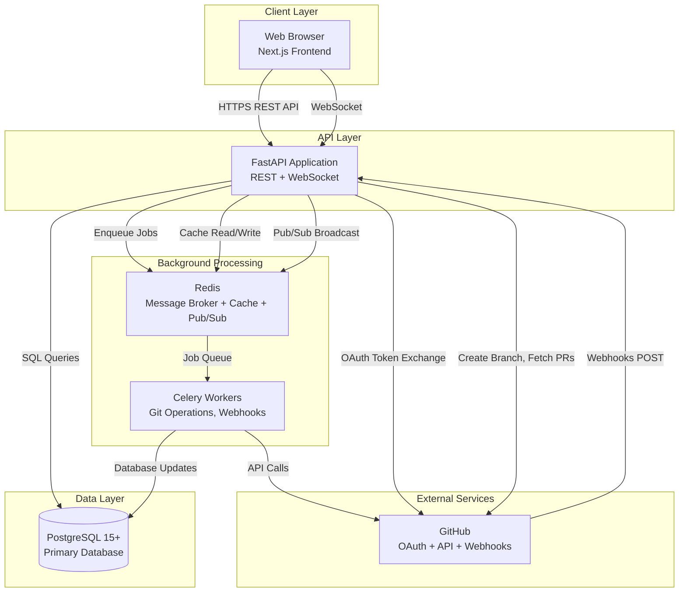

# High Level Architecture

## Technical Summary

Taskly employs a **monolithic API architecture** with a separate background job queue, deployed as a containerized application using Docker. The backend is built on **FastAPI (Python 3.11+)** with **async SQLAlchemy 2.0** for database operations and **Celery + Redis** for asynchronous task processing. The system integrates tightly with **GitHub via OAuth 2.0 and webhooks**, enabling bidirectional synchronization between project boards and Git repositories. Real-time collaboration is powered by **FastAPI WebSockets** with Redis pub/sub for multi-instance coordination. This architecture directly supports the PRD's core goal: treating the project board as a "control surface for your repo" by automating Git workflows (branch creation, PR linking) and reflecting code activity (commits, CI status, merges) on cards in real-time, eliminating double-entry work and preserving task-to-code context.

## High Level Overview

**1. Architectural Style: Monolithic API with Job Queue Separation**

Per PRD Technical Assumptions, we're using a **single FastAPI application** handling all REST endpoints and WebSocket connections, with **Celery workers** processing long-running tasks asynchronously. This avoids premature microservices complexity while maintaining non-blocking API responses for Git operations.

**2. Repository Structure: Monorepo (npm workspaces)**

Single repository with `/frontend` and `/backend` directories enables atomic commits, simplified CI/CD, and reduced context switching for the small team (1-3 developers).

**3. Service Architecture Components:**
- **FastAPI API Server:** REST endpoints, WebSocket server, synchronous request handling
- **Celery Workers:** Git operations (branch creation, webhook processing), bulk updates, email notifications
- **PostgreSQL 15+:** Primary data store (relational data + JSONB for flexible metadata)
- **Redis:** Celery message broker, session storage, caching layer, WebSocket pub/sub

**4. Primary User/Data Flow:**
- User authenticates via GitHub OAuth → JWT tokens issued
- User manipulates cards on board (drag-and-drop, edit) → FastAPI API updates PostgreSQL → WebSocket broadcasts changes
- User clicks "Create Branch" → FastAPI enqueues Celery job → Celery worker calls GitHub API → Card updated with branch link
- GitHub webhook fires (PR merged) → FastAPI validates, enqueues job → Celery processes → Card auto-moved to Done → WebSocket notifies users

**5. Key Architectural Decisions:**

| Decision | Rationale |
|----------|-----------|
| **Monolith over Microservices** | PRD targets <10k users; monolith simpler to develop/debug/deploy. Scale vertically first. |
| **Celery for async jobs** | GitHub API calls can take 1-3s; offloading to workers keeps API responsive (<200ms). |
| **PostgreSQL (not NoSQL)** | JSONB provides flexibility, but relational model fits boards/cards/users better. ACID transactions critical for Git sync. |
| **FastAPI WebSockets** | Integrated solution; no need for separate Socket.IO server. Falls back to polling if needed. |
| **Redis for multiple concerns** | Consolidated infrastructure: message broker + cache + pub/sub reduces operational complexity. |

## High Level Project Diagram

## Architectural and Design Patterns

**Pattern Selection Rationale:** These patterns align with PRD goals (Git-native sync, real-time collaboration, developer productivity) and the chosen tech stack.

**1. Repository Pattern**
- **Description:** Abstract data access logic behind repository interfaces (`CardRepository`, `WorkspaceRepository`, etc.)
- **Implementation:** SQLAlchemy 2.0 async sessions wrapped in repository classes
- **Rationale:** Enables unit testing with mock repositories, isolates ORM concerns from business logic, makes future database migrations easier.
- **Example:** `CardRepository.get_by_id(card_id)` instead of direct `session.query(Card).filter_by(id=card_id)`

**2. Service Layer Pattern**
- **Description:** Business logic lives in service classes (`CardService`, `GitIntegrationService`), not in API route handlers
- **Implementation:** Services injected into FastAPI dependencies
- **Rationale:** Keeps route handlers thin (validation + serialization only), reusable logic across API and Celery tasks, easier testing.
- **Example:** `CardService.move_card(card_id, target_column_id)` handles position recalculation, activity logging, WebSocket broadcast

**3. Background Job Pattern (Task Queue)**
- **Description:** Long-running operations executed asynchronously via Celery
- **Implementation:** Celery tasks with retry logic, idempotency keys, progress tracking
- **Rationale:** PRD requires <3s Git operations; Celery offloads work, maintains API responsiveness. Retry with exponential backoff handles GitHub API flakiness.
- **Jobs:** `create_branch_task`, `process_webhook_task`, `bulk_update_cards_task`, `send_email_task`

**4. Webhook Event Handler Pattern**
- **Description:** Idempotent webhook processors with signature validation and event routing
- **Implementation:** FastAPI endpoint validates HMAC, enqueues job with event_id deduplication
- **Rationale:** GitHub may deliver webhooks multiple times; idempotency prevents duplicate card updates. Async processing prevents webhook timeout retries.
- **Flow:** `POST /webhooks/github` → validate signature → check event_id in Redis → enqueue if new → return 200 OK

**5. Command Query Responsibility Segregation (CQRS-lite)**
- **Description:** Separate read models (queries) from write operations (commands)
- **Implementation:** Read queries hit cached data (Redis), writes invalidate cache and broadcast via WebSocket
- **Rationale:** Board views are read-heavy (users browsing cards); caching reduces database load. Writes trigger invalidation + real-time sync.
- **Example:** `GET /boards/{id}` serves cached board, `PATCH /cards/{id}` updates DB + clears cache + broadcasts

**6. Optimistic UI Pattern (Frontend-Backend Contract)**
- **Description:** Frontend applies changes immediately, backend confirms/rolls back
- **Implementation:** API returns updated entity + timestamp; WebSocket broadcasts canonical state
- **Rationale:** PRD requires <500ms UI responsiveness; optimistic updates eliminate perceived lag. Backend is source of truth.

**7. Circuit Breaker Pattern (GitHub API Resilience)**
- **Description:** Temporarily stop calling GitHub API after repeated failures
- **Implementation:** `tenacity` library with exponential backoff, max retries, circuit breaker state
- **Rationale:** GitHub API rate limits (5000 req/hr) or outages shouldn't crash Taskly. Graceful degradation: show stale data with warning.

---
