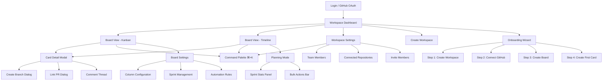
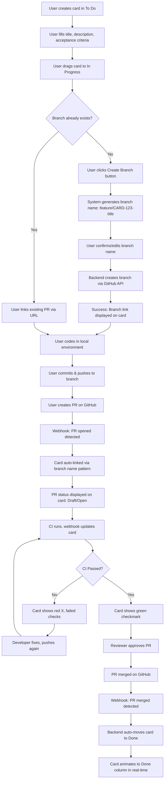
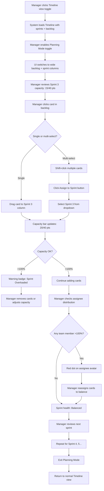
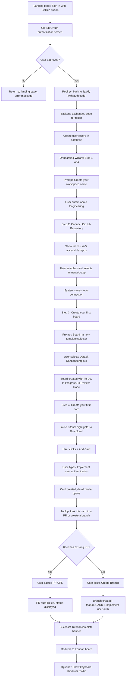

```mermaid
graph TD
    A[User presses ⌘+K] --> B[Command palette opens, search input focused]
    B --> C[User types: cre card]
    C --> D[Fuzzy match: Create Card command highlighted]
    D --> E[User presses Enter]
    E --> F[Palette shows: Which column?]

    F --> G[User types: prog]
    G --> H[Fuzzy match: In Progress column]
    H --> I[User presses Enter]
    I --> J[Quick-create input appears in In Progress column]
    J --> K[User types card title, presses Enter]
    K --> L[Card created]

    L --> M[User presses ⌘+K again]
    M --> N[User types: timeline]
    N --> O[Match: Switch to Timeline View]
    O --> P[User presses Enter]
    P --> Q[View switches to Timeline in <500ms]

    Q --> R[User presses ⌘+K]
    R --> S[User types: #auth]
    S --> T[# prefix triggers card search mode]
    T --> U[Shows cards matching authentication]
    U --> V[User presses ↓ to select, Enter to open]
    V --> W[Card detail modal opens]

    W --> X[User makes changes, presses Escape]
    X --> Y[Modal closes, back to Timeline view]
```

# Taskly UI/UX Specification

## Introduction

This document defines the user experience goals, information architecture, user flows, and visual design specifications for Taskly's user interface. It serves as the foundation for visual design and frontend development, ensuring a cohesive and user-centered experience.

The specification is informed by the Product Requirements Document and focuses on delivering a "developer-first, zero-friction" UX philosophy that prioritizes speed, clarity, and keyboard-driven workflows. Taskly bridges project management and code development, transforming traditional boards into a Git-native "control surface for your repo."

### Overall UX Goals & Principles

#### Target User Personas

1. **Developer (Primary):** Software engineers (IC levels) who need fast task-to-code workflows. They value keyboard shortcuts, GitHub integration, and minimal context switching. Success = moving from card to PR in <30 seconds.

2. **Engineering Manager (Secondary):** Tech leads and engineering managers who need sprint planning and team capacity visibility. They value Timeline view, workload balancing, and progress tracking. Success = planning 2-week sprint in <15 minutes.

3. **Product/Project Manager (Tertiary):** PMs who collaborate with dev teams and need to track feature status linked to code. They value card metadata, filtering, and real-time PR status. Success = understanding "what shipped" without asking developers.

#### Usability Goals

- **Ease of learning:** New developers can create their first card and link it to a PR within 5 minutes of onboarding
- **Efficiency of use:** Power users can navigate entire board, create cards, and move between views using only keyboard (zero mouse dependency)
- **Git operation speed:** Branch creation from card completes in <3 seconds; PR status updates appear in <1 second via webhooks
- **Minimal cognitive load:** Card status (In Progress, PR status, CI results) visible at a glance without opening details
- **Error prevention:** Destructive actions (delete card, disconnect repo, delete workspace) require explicit confirmation with typed verification for critical operations

#### Design Principles

1. **Speed Above All** - Every interaction must complete in <500ms with optimistic UI updates. Perceived performance matters more than technical benchmarks.

2. **Keyboard-First, Mouse-Optional** - Power users should accomplish 95% of tasks via keyboard. Command palette (⌘+K) is the primary interface for experienced users.

3. **Context Preservation** - Never force users to leave Taskly to understand task state. PR status, commits, CI results visible inline on cards.

4. **Progressive Disclosure** - Cards show summary by default (title, assignee, PR badge); expand inline for full context. Balance information density with visual calm.

5. **GitHub-Native Integration** - Git operations (branch creation, PR linking, webhooks) should feel like native Taskly features, not "integrations."

### Change Log

| Date | Version | Description | Author |
|------|---------|-------------|--------|
| 2025-10-22 | 1.0 | Initial UI/UX specification draft | UX Expert (Sally) |

## Information Architecture (IA)

### Site Map / Screen Inventory



### Navigation Structure

**Primary Navigation (Top Bar - Always Visible):**
- Left: Taskly logo (returns to Workspace Dashboard)
- Center: Current workspace name (dropdown to switch workspaces)
- Right: Command palette trigger (⌘+K badge visible), User avatar (dropdown: Profile, Settings, Logout)

**Secondary Navigation (Board Context):**
- Board header bar:
  - Left: Board name (inline editable), Star/favorite toggle
  - Center: View toggle buttons (Kanban | Timeline), Active sprint indicator (for Timeline view)
  - Right: Filter controls (Assignee, Label, Priority dropdowns), Search input, Board settings gear icon

**Breadcrumb Strategy:**
- **Workspace Dashboard:** No breadcrumb (top level)
- **Board Views:** `Workspace Name > Board Name` (both clickable)
- **Card Detail Modal:** Overlays current view, shows card ID + title in modal header, no breadcrumb change
- **Settings Pages:** `Workspace Name > Settings` or `Board Name > Board Settings`
- Breadcrumbs remain persistent in top bar even when modals open (provides context anchoring)

**Contextual Navigation (Modal/Overlay):**
- **Command Palette (⌘+K):** Global overlay accessible from anywhere, keyboard-driven navigation
- **Card Detail:** Modal overlay with tabs (Details | Activity | Linked PRs), close via Escape or X button
- **Onboarding Wizard:** Full-screen takeover with step indicators (1/4, 2/4, etc.), Skip option in top-right

**Mobile/Tablet Adaptation:**
- Tablet (768-1024px): Primary nav collapses workspace dropdown to icon, secondary nav shows only View toggle + Search (other controls in overflow menu)
- Mobile (<768px): Simplified nav with hamburger menu, no command palette (touch-optimized alternatives)

## User Flows

### Flow 1: Complete Task Workflow (Card to Merged PR)

**User Goal:** Move a development task from idea to deployed code with automated synchronization

**Entry Points:**
- Kanban board "To Do" column
- Command palette: ⌘+K → "Create Card"
- Quick-create button in any column header

**Success Criteria:**
- Card automatically moves to "Done" when PR merges
- All Git activity visible on card without leaving Taskly
- Zero manual status updates required

#### Flow Diagram



#### Edge Cases & Error Handling:

- **Branch name conflict:** Show error "Branch already exists", suggest alternative name with -v2 suffix, offer link to existing branch
- **GitHub API timeout:** Show loading state for max 5s, then error toast "Couldn't create branch. Retry or create manually." with copy-branch-name button
- **PR auto-link fails:** User can manually link PR via "+ Link Pull Request" button, system learns pattern for future auto-detection
- **Multiple linked PRs:** Card only auto-moves when ALL linked PRs are merged (configurable: "any" vs "all" in board settings)
- **User removed from workspace:** Webhook-triggered auto-move uses system actor "[GitHub]" to bypass permission checks

**Notes:** This is the "golden path" that validates Taskly's core value proposition. Every optimization here (branch creation speed, webhook latency, real-time updates) directly impacts user satisfaction. Target: complete this flow 10x/day per developer without friction.

### Flow 2: Sprint Planning Session (Manager Persona)

**User Goal:** Plan upcoming 2-week sprint by assigning cards from backlog and balancing team capacity

**Entry Points:**
- Board header → Switch to Timeline view
- Command palette: ⌘+K → "Switch to Timeline View"

**Success Criteria:**
- Sprint reaches 80-100% capacity without overload
- All team members have balanced workload
- Cards assigned with clear prioritization

#### Flow Diagram



#### Edge Cases & Error Handling:

- **Empty backlog:** Show empty state "All caught up! No unplanned cards." with "Create Card" button
- **No sprints defined:** Timeline shows only backlog column + tooltip "Create your first sprint in Board Settings"
- **Over-capacity drag attempt:** Show confirmation modal "Sprint 3 is overloaded (45/40 pts). Add 3 cards anyway?" with Yes/Cancel
- **Bulk assign to full sprint:** System adds all cards but displays warning "Sprint 3 now overloaded (+15 pts over capacity)"
- **Undo accidental bulk move:** Ctrl+Z immediately reverts sprint assignment for last action (session-based undo stack)

**Notes:** Timeline view differentiates Taskly from Trello/Linear. Capacity indicators (color-coded bars, health scores) must be instantly scannable. Target: plan full sprint in <15 minutes vs. 30-45 minutes in spreadsheet/manual board updates.

### Flow 3: Onboarding New User (First-Time Experience)

**User Goal:** Go from signup to first linked PR in <10 minutes

**Entry Points:**
- Marketing site "Get Started" CTA
- Direct signup URL

**Success Criteria:**
- User completes: GitHub auth → workspace created → repository connected → board created → first card linked to PR
- User understands Taskly's core value (Git synchronization)
- Zero drop-off during critical steps

#### Flow Diagram



#### Edge Cases & Error Handling:

- **GitHub auth denied:** Show message "GitHub authorization required to use Taskly" with "Try Again" button
- **No accessible repos:** Show message "No repositories found. Make sure you've granted Taskly access to your repos." with "Reconnect GitHub" button
- **Workspace name taken:** Inline validation: "Workspace name already exists, try another"
- **User exits wizard early:** Show "Resume setup" banner on next login, allow skip to partial state (e.g., workspace created but no board)
- **Slow GitHub API:** Show skeleton loaders for repo list, timeout after 10s with "Having trouble loading repos. Continue anyway?" option

**Notes:** First impression critical. Each step must feel instant (<500ms transitions). Celebrate small wins (confetti on board creation, success checkmark on PR link). Skip button available after Step 2 for experienced users who want to explore first.

### Flow 4: Command Palette Power User Workflow

**User Goal:** Accomplish common tasks without touching mouse using keyboard shortcuts

**Entry Points:**
- Any screen: Press ⌘+K (Mac) or Ctrl+K (Windows/Linux)

**Success Criteria:**
- User navigates to any screen, creates cards, switches views, and performs bulk actions entirely via keyboard
- Command palette responds in <100ms

#### Flow Diagram



#### Edge Cases & Error Handling:

- **No fuzzy match found:** Show "No commands found. Try different keywords or press ? for help"
- **Command disabled in current context:** Show grayed-out command with tooltip "Not available in Timeline view"
- **Recent commands empty:** Section hidden until user executes first command
- **Keyboard shortcut conflict:** Settings page shows warning "Shortcut ⌘+B already assigned to Bold. Reassign?" when user tries to customize
- **Slow search (>100ms):** Debounce at 150ms, show spinner only if search takes >300ms

**Notes:** Command palette is Taskly's "superpower" for developers. Must feel as fast as Spotlight/Alfred. Recent commands list (5 most recent) accelerates repeated actions. Card search mode (#) eliminates need for visual scanning on large boards.

## Wireframes & Mockups

### Primary Design Files

**Design Tool:** Recommended - Figma (for collaborative design and developer handoff with inspect mode)

**Design File Organization:**
- Page 1: Design System (colors, typography, components)
- Page 2: Core Screens (Kanban, Timeline, Card Detail, Dashboard)
- Page 3: Modals & Overlays (Command Palette, Onboarding Wizard, Settings)
- Page 4: Mobile/Tablet Responsive Variants
- Page 5: Interactive Prototype (linked frames for user testing)

### Key Screen Layouts

#### Screen 1: Kanban Board View

**Purpose:** Primary daily workspace for developers to manage task flow and visualize work in progress

**Key Elements:**

- **Fixed Top Bar (60px height):** Primary navigation + breadcrumbs
- **Fixed Board Header (80px height):** Board name, view toggle, filters, search, settings
- **Scrollable Content Area:** Multi-column Kanban board with horizontal scroll if needed
- **Column Layout:** 320px width per column, 16px gaps, vertical card stacking with 12px spacing
- **Card Compact View:** Card ID, title (max 2 lines), assignee avatars (max 3 visible), labels, priority indicator, PR badge, CI status, due date
- **Hover States:** Card elevation with shadow, quick action icons (edit, assign, delete)
- **Drag Behavior:** Semi-transparent ghost preview, drop zones highlight blue
- **Real-Time Indicators:** User presence dots, yellow pulse on actively edited cards, green flash on webhook updates

**Interaction Notes:** Hover shows quick actions, click expands or opens modal (configurable), drag-and-drop with visual feedback, multi-select with checkboxes

**Design File Reference:** `Figma Frame: Kanban-Board-Desktop-1920x1080`

**ASCII Wireframe:**

```
┌──────────────────────────────────────────────────────────────────────────────────────────────┐
│  🎯 Taskly          [Acme Engineering ▼]                           [⌘K Search] [@User ▼]    │
├──────────────────────────────────────────────────────────────────────────────────────────────┤
│  ⭐ Sprint 3 Board  [📊 Kanban | 📅 Timeline]  👤 Assignee ▼ 🏷️ Label ▼ 🔍 Search...  ⚙️   │
├──────────────────────────────────────────────────────────────────────────────────────────────┤
│                                                                                              │
│  ┌──────────────────┬──────────────────┬──────────────────┬──────────────────┐             │
│  │   📋 To Do       │ 🔄 In Progress   │ 👀 In Review     │ ✅ Done          │             │
│  │   (5 cards)      │ (3 cards)        │ (2 cards)        │ (8 cards)        │             │
│  │   ───────────    │   ───────────    │   ───────────    │   ───────────    │             │
│  │   [+ Add Card]   │   [+ Add Card]   │   [+ Add Card]   │   [+ Add Card]   │             │
│  │                  │                  │                  │                  │             │
│  │ ┌──────────────┐ │ ┌──────────────┐ │ ┌──────────────┐ │ ┌──────────────┐ │             │
│  │ │ CARD-123     │ │ │ CARD-456     │ │ │ CARD-789     │ │ │ CARD-012     │ │             │
│  │ │ Implement    │ │ │ Add user API │ │ │ Dashboard UI │ │ │ Deploy prod  │ │             │
│  │ │ user auth... │ │ │ endpoints... │ │ │ components   │ │ │ environment  │ │             │
│  │ │              │ │ │              │ │ │              │ │ │              │ │             │
│  │ │ 👤👤 @alice   │ │ │ 👤 @bob      │ │ │ 👤👤👤 @team  │ │ │ 👤 @dave     │ │             │
│  │ │ 🔴 High  5pts│ │ │ 🟡 Med   8pts│ │ │ 🟢 Low   3pts│ │ │ 🔵 Med   5pts│ │             │
│  │ │ 🏷️ backend   │ │ │ 🏷️ api       │ │ │ 🏷️ frontend  │ │ │ 🏷️ devops    │ │             │
│  │ │              │ │ │ 🟢 PR #234   │ │ │ ✅ PR #567   │ │ │ ✅ Merged    │ │             │
│  │ │ 📅 Due: 3d   │ │ │ ⚠️ CI Failed │ │ │ ✅ CI Passed │ │ │ 💬 3 comments│ │             │
│  │ └──────────────┘ │ └──────────────┘ │ └──────────────┘ │ └──────────────┘ │             │
│  │                  │                  │                  │                  │             │
│  │ ┌──────────────┐ │ ┌──────────────┐ │ ┌──────────────┐ │ ┌──────────────┐ │             │
│  │ │ CARD-124     │ │ │ CARD-457     │ │ │ CARD-790     │ │ │ CARD-013     │ │             │
│  │ │ Fix login... │ │ │ Add tests... │ │ │ Responsive.. │ │ │ Update docs  │ │             │
│  │ │ 👤 @carol    │ │ │ 👤👤 @alice   │ │ │              │ │ │              │ │             │
│  │ │ 🟡 Med   3pts│ │ │ 🟢 Low   2pts│ │ │              │ │ │              │ │             │
│  │ └──────────────┘ │ └──────────────┘ │                  │                  │             │
│  │                  │                  │                  │                  │             │
│  │ ┌──────────────┐ │ ┌──────────────┐ │                  │                  │             │
│  │ │ CARD-125     │ │ │ CARD-458     │ │                  │ (scroll down)   │             │
│  │ │ Write docs.. │ │ │ ⚡ Editing... │ │                  │                  │             │
│  │ └──────────────┘ │ └──────────────┘ │                  │                  │             │
│  │                  │                  │                  │                  │             │
│  └──────────────────┴──────────────────┴──────────────────┴──────────────────┘             │
│                                                                                              │
└──────────────────────────────────────────────────────────────────────────────────────────────┘

Legend:
  👤 = Assignee avatars (stacked when multiple)
  🔴🟡🟢🔵 = Priority indicators (Urgent/High/Med/Low)
  🏷️ = Labels
  🟢 PR = Pull request badge with status
  ✅/⚠️ = CI status indicators
  📅 = Due date
  💬 = Comment count
  ⚡ = Real-time editing indicator (yellow pulse)
```

#### Screen 2: Timeline View (Sprint Planning)

**Purpose:** Horizontal timeline for engineering managers to plan sprints and balance team capacity

**Key Elements:**

- **Sprint Columns:** 280px width, chronological left-to-right, backlog on far left
- **Column Header:** Sprint name, date range, days remaining, capacity bar (color-coded: green <80%, yellow 80-100%, red >100%), story points/card count
- **Planning Mode Sidebar:** Sprint statistics panel (280px width, collapsible), shows all sprints with capacity bars and "Add Cards" CTAs
- **Capacity Bar:** Horizontal progress bar showing utilization percentage with color coding
- **Card Compact Display:** Same card component as Kanban but narrower (280px)

**Interaction Notes:** Horizontal scroll for timeline navigation, zoom controls (+/-), drag cards between sprints with real-time capacity updates, multi-select for bulk sprint assignment

**Design File Reference:** `Figma Frame: Timeline-View-Planning-Mode-1920x1080`

**ASCII Wireframe:**

```
┌──────────────────────────────────────────────────────────────────────────────────────────────────────────────┐
│  🎯 Taskly          [Acme Engineering ▼]                                    [⌘K Search] [@User ▼]           │
├──────────────────────────────────────────────────────────────────────────────────────────────────────────────┤
│  ⭐ Sprint Planning  [📊 Kanban | 📅 Timeline]  [🎯 Planning Mode: ON]  👤 ▼ 🏷️ ▼ 🔍 Search...  ⚙️        │
├──────────────────────────────────────────────────────────────────────────────────────────────────────────────┤
│                                                                                                              │
│  ◄─────────────────────────────────────────── Scroll Horizontally ─────────────────────────────────────────►│
│                                                                                                              │
│  ┌─────────────┬─────────────┬─────────────┬─────────────┬─────────────┬─────────────┐                     │
│  │  📦 Backlog │ Sprint 3    │ Sprint 4    │ Sprint 5    │ Sprint 6    │ Future      │                     │
│  │  (Unplanned)│ ⭐ ACTIVE   │ PLANNED     │ PLANNED     │ PLANNED     │ (Unplanned) │                     │
│  │             │ Dec 1-14    │ Dec 15-28   │ Jan 1-14    │ Jan 15-28   │             │                     │
│  │             │ 🕒 3d left  │ 🕒 17d away │ 🕒 31d away │ 🕒 45d away │             │                     │
│  │             │             │             │             │             │             │                     │
│  │  35 cards   │ Capacity:   │ Capacity:   │ Capacity:   │ Capacity:   │  0 cards    │                     │
│  │             │ ████████░░  │ ██████░░░░  │ ███░░░░░░░  │ ░░░░░░░░░░  │             │                     │
│  │             │ 32/40 pts   │ 24/40 pts   │ 12/40 pts   │ 0/40 pts    │             │                     │
│  │             │ 🟡 80% Full │ 🟢 60% Full │ 🟢 30% Full │ ⚪ Empty     │             │                     │
│  │             │             │             │             │             │             │                     │
│  │ ┌─────────┐ │ ┌─────────┐ │ ┌─────────┐ │ ┌─────────┐ │             │             │                     │
│  │ │CARD-999 │ │ │CARD-123 │ │ │CARD-201 │ │ │CARD-301 │ │             │             │                     │
│  │ │New feat │ │ │User auth│ │ │Analytics│ │ │Settings │ │             │             │                     │
│  │ │👤 @alice│ │ │👤👤 Team │ │ │👤 @bob  │ │ │👤 @carol│ │   [Drag    │             │                     │
│  │ │🔴 8pts  │ │ │🟡 8pts  │ │ │🟢 5pts  │ │ │🔵 8pts  │ │    cards   │             │                     │
│  │ └─────────┘ │ │In Progress│ │Planned  │ │Planned  │ │    here]   │             │                     │
│  │             │ └─────────┘ │ └─────────┘ │ └─────────┘ │             │             │                     │
│  │ ┌─────────┐ │             │             │             │             │             │                     │
│  │ │CARD-998 │ │ ┌─────────┐ │ ┌─────────┐ │ ┌─────────┐ │             │             │                     │
│  │ │API work │ │ │CARD-124 │ │ │CARD-202 │ │ │CARD-302 │ │             │             │                     │
│  │ │👤 @dave │ │ │Testing  │ │ │UI Polish│ │ │Refactor │ │             │             │                     │
│  │ │🟡 5pts  │ │ │👤 @bob  │ │ │👤👤 Team │ │ │👤 @alice│ │             │             │                     │
│  │ └─────────┘ │ │🟢 3pts  │ │ │🟡 5pts  │ │ │🟢 4pts  │ │             │             │                     │
│  │             │ └─────────┘ │ └─────────┘ └─────────┘ │             │             │                     │
│  │ (scroll)    │             │             │             │             │             │                     │
│  │             │ (8 more)    │ (4 more)    │             │             │             │                     │
│  │             │             │             │             │             │             │                     │
│  └─────────────┴─────────────┴─────────────┴─────────────┴─────────────┴─────────────┘                     │
│                                                                                                              │
│  ┌─ Sprint Stats Panel (Collapsible) ──────────────────────────────────────────────────┐                    │
│  │  📊 Sprint 3 Health: 🟡 Near Capacity                                                │                    │
│  │  ├─ Total Story Points: 32/40 (80%)                                                  │                    │
│  │  ├─ Cards: 12 cards                                                                  │                    │
│  │  ├─ Team Capacity:                                                                   │                    │
│  │  │   • 👤 @alice: ████████░░ 16/20 pts (80%) 🟡                                      │                    │
│  │  │   • 👤 @bob:   ██████░░░░ 8/15 pts (53%)  🟢                                      │                    │
│  │  │   • 👤 @carol: ████░░░░░░ 8/20 pts (40%)  🟢                                      │                    │
│  │  └─ Sprint Goal: "Complete authentication & user management features"               │                    │
│  └──────────────────────────────────────────────────────────────────────────────────────┘                    │
│                                                                                                              │
└──────────────────────────────────────────────────────────────────────────────────────────────────────────────┘

Legend:
  ⭐ = Active sprint
  🕒 = Time remaining/until start
  ████░░░░░░ = Capacity bar (filled portion = used capacity)
  🟢🟡🔴⚪ = Sprint health indicator (Good/Near Full/Overloaded/Empty)
  Planning Mode = Wide backlog view + bulk assignment tools enabled
```

#### Screen 3: Card Detail Modal

**Purpose:** Expanded view for editing full card metadata, viewing linked PRs/commits, and reading activity timeline

**Key Elements:**

- **Modal Dimensions:** 800px width, 90vh height, centered overlay
- **Header:** Card ID + editable title, close (X) button, delete button
- **Tab Navigation:** Details | Activity | Linked PRs
- **Tab 1 - Details:** Title, description (markdown editor with preview), acceptance criteria (markdown), assignees, priority, story points, due date, labels, sprint assignment
- **Tab 2 - Activity:** Chronological timeline feed, comment composer with markdown support
- **Tab 3 - Linked PRs:** PR cards showing status, branch names, CI results, commit count, approvals, "Link Pull Request" button, "Create Branch" button (if no PRs)

**Interaction Notes:** Auto-save with 2s debounce, markdown live preview toggle, keyboard shortcuts (Escape to close, ⌘+Enter for comment), real-time activity updates

**Design File Reference:** `Figma Frame: Card-Detail-Modal-Tabs`

**ASCII Wireframe:**

```
                         ┌────────────────────────────────────────────────────────┐
                         │  CARD-123: Implement user authentication              │
    [Backdrop: 60%       │                                                   [✕]  │
     opacity overlay]    ├────────────────────────────────────────────────────────┤
                         │                                                        │
                         │  [📝 Details] [📜 Activity] [🔗 Linked PRs]            │
                         │  ═══════════                                           │
                         │                                                        │
                         │  ┌─ Title ─────────────────────────────────────────┐  │
                         │  │ Implement user authentication with OAuth 2.0   │  │
                         │  └─────────────────────────────────────────────────┘  │
                         │                                                        │
                         │  ┌─ Description ────────────────────────────────────┐ │
                         │  │ # Overview                                       │ │
                         │  │ Add OAuth 2.0 authentication using GitHub as    │ │
                         │  │ the identity provider.                          │ │
                         │  │                                                  │ │
                         │  │ ## Technical Details                            │ │
                         │  │ - Use NextAuth.js for OAuth flow                │ │
                         │  │ - Store session in Redis                        │ │
                         │  │ - Add middleware for protected routes           │ │
                         │  │                                                  │ │
                         │  │ [📝 Edit] [👁️ Preview]                           │ │
                         │  └──────────────────────────────────────────────────┘ │
                         │                                                        │
                         │  ┌─ Acceptance Criteria ────────────────────────────┐ │
                         │  │ - [ ] User can sign in with GitHub              │ │
                         │  │ - [ ] Session persists across page reloads      │ │
                         │  │ - [ ] Protected routes redirect to login        │ │
                         │  │ - [ ] User can log out successfully             │ │
                         │  └──────────────────────────────────────────────────┘ │
                         │                                                        │
                         │  ┌─ Metadata ───────────────────────────────────────┐ │
                         │  │ Assignees:  👤 @alice  👤 @bob    [+ Assign]    │ │
                         │  │ Priority:   🔴 High ▼                            │ │
                         │  │ Story Pts:  [8] pts                              │ │
                         │  │ Due Date:   📅 Dec 15, 2024                      │ │
                         │  │ Labels:     🏷️ backend  🏷️ auth  [+ Add]        │ │
                         │  │ Sprint:     Sprint 3 ▼                           │ │
                         │  │ Column:     In Progress ▼                        │ │
                         │  └──────────────────────────────────────────────────┘ │
                         │                                                        │
                         │                                              [Delete] │
                         └────────────────────────────────────────────────────────┘

Activity Tab View:                              Linked PRs Tab View:
┌────────────────────────────────────┐         ┌────────────────────────────────────┐
│  [📝 Details] [📜 Activity] [🔗 PRs]│         │  [📝 Details] [📜 Activity] [🔗 PRs]│
│             ════════════            │         │                           ═════════ │
│                                     │         │                                     │
│  ┌─ Activity Timeline ────────────┐│         │  ┌─ Pull Requests ───────────────┐ │
│  │                                 ││         │  │                                │ │
│  │  👤 @alice commented 2h ago     ││         │  │ 🟢 PR #234 - Open              │ │
│  │  "Started working on OAuth      ││         │  │ feature/CARD-123-user-auth     │ │
│  │   integration. ETA tomorrow."   ││         │  │                                │ │
│  │  💬 Reply                        ││         │  │ ⚠️ CI: 2 checks failed         │ │
│  │                                 ││         │  │ ✅ Reviews: 1 approved          │ │
│  │  🔄 @bob moved card 5h ago      ││         │  │ 📊 +234 -12 lines              │ │
│  │  From: To Do → In Progress      ││         │  │ 💬 3 comments                  │ │
│  │                                 ││         │  │                                │ │
│  │  👤 @carol mentioned you 1d ago ││         │  │ [View on GitHub]               │ │
│  │  "@alice can you review the     ││         │  │                                │ │
│  │   design mockups?"              ││         │  ├────────────────────────────────┤ │
│  │  💬 Reply                        ││         │  │                                │ │
│  │                                 ││         │  │ [+ Link Pull Request]          │ │
│  │  📌 Card created 3d ago         ││         │  │ [+ Create Branch]              │ │
│  │  by @bob                        ││         │  │                                │ │
│  │                                 ││         │  │ Branch naming pattern:         │ │
│  │  (scroll for more)              ││         │  │ feature/CARD-123-[title]       │ │
│  │                                 ││         │  │                                │ │
│  └─────────────────────────────────┘│         │  └────────────────────────────────┘ │
│                                     │         │                                     │
│  ┌─ Add Comment ──────────────────┐│         └─────────────────────────────────────┘
│  │ Write a comment...              ││
│  │                                 ││
│  │ **Bold** _Italic_ `Code`        ││
│  │ [📎 Attach] [👁️ Preview]        ││
│  │                    [Comment] ⏎  ││
│  └─────────────────────────────────┘│
└─────────────────────────────────────┘

Legend:
  Modal dimensions: 800px width × 90vh height, centered
  Tabs: Click to switch between views
  Escape key or [✕] to close
  Auto-save: 2 second debounce on all edits
```

#### Screen 4: Command Palette (⌘+K)

**Purpose:** Keyboard-first global navigation and action interface

**Key Elements:**

- **Overlay:** 800px width, centered at 25% from top, semi-transparent backdrop
- **Search Input:** Always focused, placeholder "Search commands or type # for cards..."
- **Command Sections:** Recent (max 5), Navigation, Card Actions, View Controls
- **Command Items:** Icon, name, keyboard shortcut (right-aligned)
- **Footer:** Keyboard navigation hints (↑↓ Navigate • ⏎ Select • Esc Cancel)
- **Fuzzy Matching:** Highlights matched characters in command names

**Interaction Notes:** Instant open (<100ms), fuzzy search with 150ms debounce, arrow key navigation, Enter executes, "#" prefix switches to card search mode

**Design File Reference:** `Figma Frame: Command-Palette-Overlay`

**ASCII Wireframe:**

```
                                    [Backdrop: Semi-transparent overlay]


                        ┌────────────────────────────────────────────────┐
                        │  🔍  Search commands or type # for cards...   │
                        ├────────────────────────────────────────────────┤
                        │                                                │
                        │  Recent                                        │
                        │  ───────                                       │
                        │  ➤ Create Card                          ⌘+N   │
                        │    Switch to Timeline View              ⌘+T   │
                        │    Open Card CARD-123                   ⌘+O   │
                        │                                                │
                        │  Navigation                                    │
                        │  ──────────                                    │
                        │    🏠 Dashboard                          ⌘+H   │
                        │    📊 Switch to Kanban View             ⌘+K   │
                        │    📅 Switch to Timeline View           ⌘+T   │
                        │    ⚙️ Board Settings                    ⌘+,   │
                        │    👥 Workspace Settings                       │
                        │                                                │
                        │  Card Actions                                  │
                        │  ────────────                                  │
                        │    ➕ Create Card                       ⌘+N   │
                        │    🔍 Search Cards                      #      │
                        │    📋 Bulk Edit Cards                          │
                        │    🗑️ Delete Selected Cards            ⌘+⌫    │
                        │                                                │
                        │  View Controls                                 │
                        │  ─────────────                                 │
                        │    👤 Filter by Assignee                       │
                        │    🏷️ Filter by Label                          │
                        │    🎯 Filter by Priority                       │
                        │    🧹 Clear All Filters                 ⌘+\   │
                        │                                                │
                        ├────────────────────────────────────────────────┤
                        │  ↑↓ Navigate • ⏎ Select • Esc Cancel          │
                        └────────────────────────────────────────────────┘


Search Mode (typing):                      Card Search Mode (# prefix):
┌────────────────────────────────┐         ┌────────────────────────────────┐
│  🔍  cre card                  │         │  🔍  #auth                     │
│      ^^^^^^^^ (fuzzy match)    │         │      ^^^^^ (card search)       │
├────────────────────────────────┤         ├────────────────────────────────┤
│                                │         │                                │
│  Matches                       │         │  Cards Matching "auth"         │
│  ───────                       │         │  ─────────────────────         │
│  ➤ Create Card            ⌘+N │         │  ➤ CARD-123: User auth         │
│    Create Branch               │         │    In Progress • @alice @bob   │
│    Create Sprint               │         │    🟢 PR #234 • ⚠️ CI Failed   │
│                                │         │                                │
│  No more results               │         │    CARD-456: Auth middleware   │
│                                │         │    To Do • @carol              │
│                                │         │    🔴 High Priority            │
│                                │         │                                │
│                                │         │    CARD-789: OAuth setup       │
│                                │         │    Done • @dave                │
│                                │         │    ✅ Merged                   │
│                                │         │                                │
│                                │         │  3 results                     │
│                                │         │                                │
├────────────────────────────────┤         ├────────────────────────────────┤
│  ↑↓ Navigate • ⏎ Select        │         │  ↑↓ Navigate • ⏎ Open Card     │
└────────────────────────────────┘         └────────────────────────────────┘

Legend:
  Dimensions: 800px width, centered at 25% from top
  ➤ = Currently selected item (highlighted)
  Opens instantly (<100ms), fuzzy search with 150ms debounce
  # prefix switches to card search mode
  Escape closes palette, Enter executes selected command
```

#### Screen 5: Workspace Dashboard

**Purpose:** Landing page after login showing all boards with quick access and workspace-level navigation

**Key Elements:**

- **Hero Section:** Workspace name, description, member avatars, "+ Invite Members" button
- **Board Grid:** 3-column responsive grid (350px cards), auto-fill layout
- **Board Card:** Board name, last updated timestamp, card count, active sprint progress bar, member avatars (max 5 visible), favorite toggle, settings link
- **Empty State:** Centered illustration, "Welcome to Taskly!" heading, "Get started" subheading, "+ Create Board" CTA, tutorial link

**Interaction Notes:** Hover lifts card with shadow, click navigates to board, favorite toggle prioritizes in grid

**Design File Reference:** `Figma Frame: Workspace-Dashboard-Desktop`

**ASCII Wireframe:**

```
┌──────────────────────────────────────────────────────────────────────────────────────┐
│  🎯 Taskly          [Acme Engineering ▼]                    [⌘K Search] [@User ▼]   │
├──────────────────────────────────────────────────────────────────────────────────────┤
│                                                                                      │
│  ┌────────────────────────────────────────────────────────────────────────────────┐ │
│  │  👥 Acme Engineering                                                           │ │
│  │  Building amazing software, one sprint at a time                              │ │
│  │                                                                                │ │
│  │  👤👤👤👤👤 +12 members                              [+ Invite Members]         │ │
│  └────────────────────────────────────────────────────────────────────────────────┘ │
│                                                                                      │
│  ┌─ Your Boards ─────────────────────────────────────────────────────┐             │
│  │                                                      [+ New Board] │             │
│  │                                                                    │             │
│  │  ┌──────────────────┐  ┌──────────────────┐  ┌──────────────────┐ │             │
│  │  │ ⭐ Sprint 3      │  │ Backend APIs     │  │ Infrastructure   │ │             │
│  │  │                  │  │                  │  │                  │ │             │
│  │  │ 📊 Kanban        │  │ 📊 Kanban        │  │ 📅 Timeline      │ │             │
│  │  │                  │  │                  │  │                  │ │             │
│  │  │ Sprint Progress: │  │ 🎯 Q4 Goals      │  │ 🎯 DevOps        │ │             │
│  │  │ ████████░░ 80%   │  │                  │  │                  │ │             │
│  │  │ 32/40 story pts  │  │ 📝 24 cards      │  │ 📝 12 cards      │ │             │
│  │  │                  │  │ 🔄 4 in progress │  │ 🔄 2 in progress │ │             │
│  │  │ 👤👤👤👤👤          │  │ 👤👤👤            │  │ 👤👤              │ │             │
│  │  │                  │  │                  │  │                  │ │             │
│  │  │ ⭐ Favorite  ⚙️  │  │ ☆ Favorite  ⚙️   │  │ ☆ Favorite  ⚙️   │ │             │
│  │  │                  │  │                  │  │                  │ │             │
│  │  │ Updated 2h ago   │  │ Updated 5h ago   │  │ Updated 1d ago   │ │             │
│  │  └──────────────────┘  └──────────────────┘  └──────────────────┘ │             │
│  │                                                                    │             │
│  │  ┌──────────────────┐  ┌──────────────────┐  ┌──────────────────┐ │             │
│  │  │ Mobile App       │  │ Design System    │  │ Documentation    │ │             │
│  │  │                  │  │                  │  │                  │ │             │
│  │  │ 📊 Kanban        │  │ 📊 Kanban        │  │ 📅 Timeline      │ │             │
│  │  │                  │  │                  │  │                  │ │             │
│  │  │ 📝 18 cards      │  │ 📝 31 cards      │  │ 📝 8 cards       │ │             │
│  │  │ 🔄 6 in progress │  │ 🔄 3 in progress │  │ ✅ 6 done        │ │             │
│  │  │                  │  │                  │  │                  │ │             │
│  │  │ 👤👤👤👤           │  │ 👤👤              │  │ 👤               │ │             │
│  │  │                  │  │                  │  │                  │ │             │
│  │  │ ☆ Favorite  ⚙️   │  │ ☆ Favorite  ⚙️   │  │ ☆ Favorite  ⚙️   │ │             │
│  │  │                  │  │                  │  │                  │ │             │
│  │  │ Updated 3d ago   │  │ Updated 1w ago   │  │ Updated 2w ago   │ │             │
│  │  └──────────────────┘  └──────────────────┘  └──────────────────┘ │             │
│  │                                                                    │             │
│  └────────────────────────────────────────────────────────────────────┘             │
│                                                                                      │
└──────────────────────────────────────────────────────────────────────────────────────┘


Empty State (No Boards):
┌──────────────────────────────────────────────────────────────────────┐
│                                                                      │
│                           📋                                         │
│                     [Empty state                                     │
│                      illustration]                                   │
│                                                                      │
│                   Welcome to Taskly!                                 │
│                                                                      │
│         Get started by creating your first board to organize         │
│         tasks and collaborate with your team.                        │
│                                                                      │
│                      [+ Create Your First Board]                     │
│                                                                      │
│                         [📚 View Tutorial]                           │
│                                                                      │
└──────────────────────────────────────────────────────────────────────┘

Legend:
  Board cards: 350px width, 3-column responsive grid
  Hover: Card lifts with shadow elevation
  Click: Navigates to board
  ⭐ = Favorited board (appears first in grid)
  Progress bar shows active sprint completion
```

#### Screen 6: Onboarding Wizard (Multi-Step)

**Purpose:** Guide new users through critical setup: workspace creation, GitHub connection, board setup, first card

**Key Elements:**

- **Full-Screen Layout:** Logo + step indicator + skip button (top bar), step heading + subheading (centered), main content area, back/continue navigation, progress dots
- **Step 2 Example (Connect GitHub):** Repository list with search, checkboxes for multi-select, repo metadata (stars, last updated)
- **Step Indicators:** Filled dots for completed, outlined for upcoming, current highlighted
- **Loading States:** Skeleton loaders for async operations (repo fetching)

**Interaction Notes:** Skip available after Step 2, back button preserves data, continue disabled until requirements met, celebrates milestones (confetti on board creation)

**Design File Reference:** `Figma Frame: Onboarding-Wizard-All-Steps`

**ASCII Wireframe:**

```
Step 1: Create Workspace
┌──────────────────────────────────────────────────────────────────────────────┐
│  🎯 Taskly                                                      [Skip Setup] │
│                                                                              │
│                          ● ○ ○ ○    (Step 1 of 4)                           │
│                                                                              │
│                                                                              │
│                        Create your workspace                                 │
│                                                                              │
│              Give your workspace a name to get started.                      │
│              You can always change this later.                               │
│                                                                              │
│                                                                              │
│              Workspace Name                                                  │
│              ┌────────────────────────────────────────────────┐             │
│              │ Acme Engineering_                              │             │
│              └────────────────────────────────────────────────┘             │
│                                                                              │
│              Description (optional)                                          │
│              ┌────────────────────────────────────────────────┐             │
│              │ Our engineering team workspace                 │             │
│              └────────────────────────────────────────────────┘             │
│                                                                              │
│                                                                              │
│                                                                              │
│                                                                              │
│                                                                              │
│                                         [Back]  [Continue →]                │
│                                                 (disabled until name filled) │
└──────────────────────────────────────────────────────────────────────────────┘


Step 2: Connect GitHub Repository
┌──────────────────────────────────────────────────────────────────────────────┐
│  🎯 Taskly                                                      [Skip Setup] │
│                                                                              │
│                          ● ● ○ ○    (Step 2 of 4)                           │
│                                                                              │
│                                                                              │
│                     Connect GitHub Repository                                │
│                                                                              │
│            Link a repository to enable automated PR tracking.                │
│                                                                              │
│                                                                              │
│              🔍 Search repositories...                                       │
│              ┌────────────────────────────────────────────────┐             │
│              │ 🔍  acme_                                      │             │
│              └────────────────────────────────────────────────┘             │
│                                                                              │
│              ┌────────────────────────────────────────────────┐             │
│              │ ☑ acme/web-app                                 │ ◄ Selected  │
│              │   ⭐ 234    🍴 12    Updated 2h ago            │             │
│              │                                                 │             │
│              │ ☐ acme/mobile-app                              │             │
│              │   ⭐ 89     🍴 5     Updated 1d ago             │             │
│              │                                                 │             │
│              │ ☐ acme/api-service                             │             │
│              │   ⭐ 156    🍴 23    Updated 3h ago             │             │
│              │                                                 │             │
│              │ ☐ acme/infrastructure                          │             │
│              │   ⭐ 45     🍴 8     Updated 1w ago             │             │
│              │                                (scroll for more)│             │
│              └────────────────────────────────────────────────┘             │
│                                                                              │
│              💡 You can connect more repositories later                      │
│                                                                              │
│                                         [← Back]  [Continue →]              │
└──────────────────────────────────────────────────────────────────────────────┘


Step 3: Create Your First Board
┌──────────────────────────────────────────────────────────────────────────────┐
│  🎯 Taskly                                                      [Skip Setup] │
│                                                                              │
│                          ● ● ● ○    (Step 3 of 4)                           │
│                                                                              │
│                                                                              │
│                      Create your first board                                 │
│                                                                              │
│                  Boards help you organize and track tasks.                   │
│                                                                              │
│                                                                              │
│              Board Name                                                      │
│              ┌────────────────────────────────────────────────┐             │
│              │ Sprint 3_                                      │             │
│              └────────────────────────────────────────────────┘             │
│                                                                              │
│              Choose a template                                               │
│              ┌────────────────────────────────────────────────┐             │
│              │ ● Default Kanban                               │ ◄ Selected  │
│              │   To Do → In Progress → In Review → Done       │             │
│              │                                                 │             │
│              │ ○ Simple Board                                 │             │
│              │   To Do → Done                                 │             │
│              │                                                 │             │
│              │ ○ Extended Workflow                            │             │
│              │   Backlog → To Do → In Progress → Code Review  │             │
│              │   → QA → Done                                  │             │
│              └────────────────────────────────────────────────┘             │
│                                                                              │
│                                                                              │
│                                                                              │
│                                         [← Back]  [Continue →]              │
└──────────────────────────────────────────────────────────────────────────────┘


Step 4: Create Your First Card
┌──────────────────────────────────────────────────────────────────────────────┐
│  🎯 Taskly                                                                   │
│                                                                              │
│                          ● ● ● ●    (Step 4 of 4)                           │
│                                                                              │
│                         🎉 Almost there!                                     │
│                                                                              │
│                    Create your first card to get started.                    │
│                                                                              │
│  ┌─────────────────────┬─────────────────────┬────────────────────────────┐ │
│  │   📋 To Do          │ 🔄 In Progress      │ 👀 In Review  ✅ Done      │ │
│  │   ───────────       │                     │                            │ │
│  │   [+ Add Card] ◄─── Click here to start  │                            │ │
│  │        ▲            │                     │                            │ │
│  │        │            │                     │                            │ │
│  │    [Tooltip:        │                     │                            │ │
│  │   "Add your first   │                     │                            │ │
│  │    card here!"]     │                     │                            │ │
│  │                     │                     │                            │ │
│  └─────────────────────┴─────────────────────┴────────────────────────────┘ │
│                                                                              │
│              💡 Pro tip: Link cards to GitHub PRs for automatic tracking    │
│                                                                              │
│                                                                              │
│                                                                              │
│                                                      [← Back]  [Finish! →]  │
└──────────────────────────────────────────────────────────────────────────────┘


Success State (After Creating First Card):
┌──────────────────────────────────────────────────────────────────────────────┐
│                                                                              │
│                                🎉                                            │
│                          [Confetti animation]                                │
│                                                                              │
│                       You're all set!                                        │
│                                                                              │
│                 Your workspace is ready to go.                               │
│         Start managing your tasks and linking them to PRs.                   │
│                                                                              │
│                                                                              │
│                         [Go to Dashboard]                                    │
│                                                                              │
│                    [⌨️ View Keyboard Shortcuts]                              │
│                                                                              │
└──────────────────────────────────────────────────────────────────────────────┘

Legend:
  ● = Completed step (filled dot)
  ○ = Upcoming step (outlined dot)
  Progress: 1/4, 2/4, 3/4, 4/4
  [Skip Setup] available after Step 2
  Celebrates completion with confetti animation
```

#### Screen 7: Board Settings (Sprint Management)

**Purpose:** Configure sprints for timeline planning

**Key Elements:**

- **2-Column Layout:** Left sidebar (240px) with navigation tabs, main content area
- **Sprint List:** Sprint cards showing name, date range, capacity bar, story point usage, card count, goal text, edit/delete/complete actions
- **Active Sprint Badge:** Green "Active" label, protected from deletion
- **Create Sprint Modal:** Name, start/end date pickers, capacity input, goal textarea, template dropdown

**Interaction Notes:** Complete sprint archives and moves unfinished cards to backlog, delete requires confirmation + name typing

**Design File Reference:** `Figma Frame: Board-Settings-Sprints-Tab`

**ASCII Wireframe:**

```
┌──────────────────────────────────────────────────────────────────────────────────────┐
│  🎯 Taskly    [Acme Engineering ▼] > Sprint 3 Board > Settings   [⌘K] [@User ▼]    │
├──────────────────────────────────────────────────────────────────────────────────────┤
│                                                                                      │
│  ┌─ Board Settings ────────────────────────────────────────────────────────────────┐│
│  │                                                                                  ││
│  │  ┌───────────┐  ┌──────────────────────────────────────────────────────────┐   ││
│  │  │ General   │  │  📅 Sprint Management                     [+ New Sprint] │   ││
│  │  │ Columns   │  │                                                          │   ││
│  │  │ Sprints   │◄─┤  Manage your sprints and plan upcoming work cycles.     │   ││
│  │  │ Automation│  │                                                          │   ││
│  │  │ Members   │  │  ┌────────────────────────────────────────────────────┐ │   ││
│  │  │ Advanced  │  │  │  Sprint 3  ⭐ ACTIVE                              │ │   ││
│  │  └───────────┘  │  │  Dec 1 - Dec 14, 2024  •  🕒 3 days remaining    │ │   ││
│  │                 │  │                                                    │ │   ││
│  │                 │  │  Capacity: ████████░░ 32/40 pts (80%) 🟡         │ │   ││
│  │                 │  │  Cards: 12 cards  •  Story Points: 32 pts        │ │   ││
│  │                 │  │                                                    │ │   ││
│  │                 │  │  Sprint Goal:                                     │ │   ││
│  │                 │  │  "Complete user authentication & profile pages"   │ │   ││
│  │                 │  │                                                    │ │   ││
│  │                 │  │  [View Timeline] [Edit] [Complete Sprint]        │ │   ││
│  │                 │  │                     (Delete disabled - active)    │ │   ││
│  │                 │  └────────────────────────────────────────────────────┘ │   ││
│  │                 │                                                          │   ││
│  │                 │  ┌────────────────────────────────────────────────────┐ │   ││
│  │                 │  │  Sprint 4  PLANNED                                 │ │   ││
│  │                 │  │  Dec 15 - Dec 28, 2024  •  🕒 Starts in 3 days    │ │   ││
│  │                 │  │                                                    │ │   ││
│  │                 │  │  Capacity: ██████░░░░ 24/40 pts (60%) 🟢         │ │   ││
│  │                 │  │  Cards: 8 cards  •  Story Points: 24 pts          │ │   ││
│  │                 │  │                                                    │ │   ││
│  │                 │  │  Sprint Goal:                                     │ │   ││
│  │                 │  │  "Analytics dashboard & reporting features"       │ │   ││
│  │                 │  │                                                    │ │   ││
│  │                 │  │  [View Timeline] [Edit] [Delete]                  │ │   ││
│  │                 │  └────────────────────────────────────────────────────┘ │   ││
│  │                 │                                                          │   ││
│  │                 │  ┌────────────────────────────────────────────────────┐ │   ││
│  │                 │  │  Sprint 5  PLANNED                                 │ │   ││
│  │                 │  │  Jan 1 - Jan 14, 2025  •  🕒 Starts in 17 days    │ │   ││
│  │                 │  │                                                    │ │   ││
│  │                 │  │  Capacity: ███░░░░░░░ 12/40 pts (30%) 🟢         │ │   ││
│  │                 │  │  Cards: 4 cards  •  Story Points: 12 pts          │ │   ││
│  │                 │  │                                                    │ │   ││
│  │                 │  │  Sprint Goal:                                     │ │   ││
│  │                 │  │  "Performance optimizations & bug fixes"          │ │   ││
│  │                 │  │                                                    │ │   ││
│  │                 │  │  [View Timeline] [Edit] [Delete]                  │ │   ││
│  │                 │  └────────────────────────────────────────────────────┘ │   ││
│  │                 │                                                          │   ││
│  │                 │  (Scroll for more sprints...)                            │   ││
│  │                 │                                                          │   ││
│  │                 └──────────────────────────────────────────────────────────┘   ││
│  │                                                                                  ││
│  └──────────────────────────────────────────────────────────────────────────────────┘│
│                                                                                      │
└──────────────────────────────────────────────────────────────────────────────────────┘


Create/Edit Sprint Modal:
┌────────────────────────────────────────────────┐
│  Create New Sprint                        [✕] │
├────────────────────────────────────────────────┤
│                                                │
│  Sprint Name *                                 │
│  ┌──────────────────────────────────────────┐ │
│  │ Sprint 6_                                │ │
│  └──────────────────────────────────────────┘ │
│                                                │
│  Duration *                                    │
│  ┌─────────────────────┬──────────────────┐   │
│  │ Start Date          │ End Date         │   │
│  │ 📅 Jan 15, 2025    │ 📅 Jan 28, 2025 │   │
│  └─────────────────────┴──────────────────┘   │
│                                                │
│  Default Capacity (Story Points) *             │
│  ┌──────────────────────────────────────────┐ │
│  │ 40                                       │ │
│  └──────────────────────────────────────────┘ │
│                                                │
│  Sprint Goal (optional)                        │
│  ┌──────────────────────────────────────────┐ │
│  │ Launch new feature set...                │ │
│  │                                          │ │
│  └──────────────────────────────────────────┘ │
│                                                │
│  Template (optional)                           │
│  ┌──────────────────────────────────────────┐ │
│  │ Use previous sprint ▼                    │ │
│  └──────────────────────────────────────────┘ │
│                                                │
│                          [Cancel]  [Create →] │
└────────────────────────────────────────────────┘

Delete Sprint Confirmation:
┌────────────────────────────────────────────────┐
│  ⚠️ Delete Sprint 5?                      [✕] │
├────────────────────────────────────────────────┤
│                                                │
│  This sprint contains 4 cards with 12 story   │
│  points. These cards will be moved to the      │
│  backlog.                                      │
│                                                │
│  To confirm, type the sprint name:            │
│  Sprint 5                                      │
│                                                │
│  ┌──────────────────────────────────────────┐ │
│  │ Sprint 5_                                │ │
│  └──────────────────────────────────────────┘ │
│                                                │
│  ⚠️ This action cannot be undone.             │
│                                                │
│                          [Cancel]  [Delete]   │
│                                    (enabled    │
│                                     when name  │
│                                     matches)   │
└────────────────────────────────────────────────┘

Legend:
  ⭐ ACTIVE = Current active sprint (protected from deletion)
  🟢🟡🔴 = Sprint health based on capacity utilization
  Complete Sprint = Archives sprint and moves unfinished cards to backlog
  Delete requires typing sprint name for confirmation
```

#### Screen 8: Mobile/Tablet Responsive

**Purpose:** Touch-optimized experience for tablet and mobile devices

**Key Elements:**

- **Tablet (1024x768):** Condensed header (60px), 280px columns, 48px minimum touch targets, long-press drag (500ms), no command palette
- **Mobile Portrait (<768px):** Single-column view with horizontal swipe, column selector tabs, full-width cards, "Best on desktop" banner, create disabled with tooltip

**Interaction Notes:** Touch-optimized drag with visual feedback, simplified navigation, read-only mobile experience for MVP

**Design File Reference:** `Figma Frame: Responsive-Tablet-Mobile`

**ASCII Wireframe:**

```
Tablet View (1024x768):
┌─────────────────────────────────────────────────────────────┐
│  🎯 [Acme ▼]              [⌘K] [@User ▼]                   │
├─────────────────────────────────────────────────────────────┤
│  ⭐ Sprint 3  [📊|📅]  👤▼ 🏷️▼ 🔍  ⋯ ⚙️                    │
├─────────────────────────────────────────────────────────────┤
│                                                             │
│  ◄─────────── Swipe to scroll horizontally ────────────►   │
│                                                             │
│  ┌─────────────┬─────────────┬─────────────┬────────────┐  │
│  │ 📋 To Do    │🔄In Progress│👀 In Review │ ✅ Done    │  │
│  │ (5)         │ (3)         │ (2)         │ (8)        │  │
│  │ [+]         │ [+]         │ [+]         │ [+]        │  │
│  │             │             │             │            │  │
│  │┌──────────┐ │┌──────────┐ │┌──────────┐ │┌─────────┐│  │
│  ││CARD-123  │ ││CARD-456  │ ││CARD-789  │ ││CARD-012 ││  │
│  ││User auth │ ││Add API   │ ││Dashboard │ ││Deploy   ││  │
│  ││          │ ││endpoints │ ││UI comps  │ ││prod env ││  │
│  ││👤👤 @team │ ││👤 @bob   │ ││👤👤👤     │ ││👤 @dave ││  │
│  ││🔴 High   │ ││🟡 Med    │ ││🟢 Low    │ ││🔵 Med   ││  │
│  ││8pts      │ ││8pts      │ ││3pts      │ ││5pts     ││  │
│  ││🏷️ backend│ ││🟢 PR#234 │ ││✅ PR#567 │ ││✅ Merged││  │
│  │└──────────┘ │└──────────┘ │└──────────┘ │└─────────┘│  │
│  │             │             │             │            │  │
│  │┌──────────┐ │┌──────────┐ │             │(scroll    │  │
│  ││CARD-124  │ ││CARD-457  │ │             │ down)     │  │
│  ││Fix login │ ││Tests     │ │             │            │  │
│  │└──────────┘ │└──────────┘ │             │            │  │
│  │             │             │             │            │  │
│  └─────────────┴─────────────┴─────────────┴────────────┘  │
│                                                             │
│  Touch: Long-press (500ms) to drag cards                   │
│  Tap card to open detail modal                             │
└─────────────────────────────────────────────────────────────┘


Mobile Portrait (<768px):
┌───────────────────────────────────┐
│  🎯 ☰                      [@] ▼ │  ◄─ Hamburger menu
├───────────────────────────────────┤
│  ⚠️ Best viewed on desktop        │  ◄─ Persistent banner
├───────────────────────────────────┤
│                                   │
│  ⭐ Sprint 3 Board                │
│                                   │
│  ┌─────────────────────────────┐ │
│  │ 📋 To Do  │🔄Progress│... ▼│ │  ◄─ Column tabs
│  │ ═════════                   │ │     (swipe to switch)
│  └─────────────────────────────┘ │
│                                   │
│  ┌─────────────────────────────┐ │
│  │ CARD-123                    │ │
│  │ Implement user auth...      │ │  ◄─ Full-width cards
│  │                             │ │     (1 column)
│  │ 👤👤 @alice @bob             │ │
│  │ 🔴 High • 8pts              │ │
│  │ 🏷️ backend                  │ │
│  │ 📅 Due: 3d                  │ │
│  │                             │ │
│  │ [Tap to view details]       │ │
│  └─────────────────────────────┘ │
│                                   │
│  ┌─────────────────────────────┐ │
│  │ CARD-124                    │ │
│  │ Fix login bug...            │ │
│  │                             │ │
│  │ 👤 @carol                   │ │
│  │ 🟡 Medium • 3pts            │ │
│  └─────────────────────────────┘ │
│                                   │
│  ┌─────────────────────────────┐ │
│  │ CARD-125                    │ │
│  │ Write documentation         │ │
│  │ 👤 @dave • 🟢 Low • 2pts    │ │
│  └─────────────────────────────┘ │
│                                   │
│  (scroll down for more cards)    │
│                                   │
├───────────────────────────────────┤
│  [📊 Board] [📅 Timeline] [⚙️]   │  ◄─ Bottom navigation
└───────────────────────────────────┘


Mobile Hamburger Menu (Expanded):
┌───────────────────────────────────┐
│  🎯 Taskly              [@] ▼  ✕ │
├───────────────────────────────────┤
│  ┌─────────────────────────────┐ │
│  │ 👥 Acme Engineering         │ │
│  │                             │ │
│  │ Workspaces:                 │ │
│  │ • Acme Engineering ✓        │ │
│  │ • Personal Projects         │ │
│  │                             │ │
│  │ Boards:                     │ │
│  │ • Sprint 3 ⭐               │ │
│  │ • Backend APIs              │ │
│  │ • Infrastructure            │ │
│  │                             │ │
│  │ ───────────────             │ │
│  │ 🏠 Dashboard                │ │
│  │ ⚙️ Settings                 │ │
│  │ 👥 Team Members             │ │
│  │ 🔌 Integrations             │ │
│  │ 📚 Help & Docs              │ │
│  │ 🚪 Logout                   │ │
│  └─────────────────────────────┘ │
│                                   │
└───────────────────────────────────┘


Mobile Card Detail (Simplified):
┌───────────────────────────────────┐
│  CARD-123                      ✕ │
├───────────────────────────────────┤
│  [Details][Activity][PRs]         │
│  ════════                          │
│                                   │
│  Implement user authentication    │
│                                   │
│  ┌─────────────────────────────┐ │
│  │ # Overview                  │ │
│  │ Add OAuth 2.0 auth using... │ │
│  │                             │ │
│  │ (tap to expand full desc)   │ │
│  └─────────────────────────────┘ │
│                                   │
│  Assignees: 👤 @alice 👤 @bob     │
│  Priority: 🔴 High                │
│  Story Points: 8                  │
│  Due: Dec 15, 2024                │
│  Labels: 🏷️ backend 🏷️ auth      │
│                                   │
│  ───────────────                  │
│                                   │
│  [Edit Card]                      │
│  [Link PR]                        │
│  [Delete]                         │
│                                   │
│  (scroll for more details)        │
│                                   │
└───────────────────────────────────┘

Legend:
  Tablet: 280px columns, condensed headers, long-press drag
  Mobile: Single column, column selector tabs, swipe navigation
  Bottom nav: Touch-optimized navigation bar
  48px minimum touch targets on mobile/tablet
  ⚠️ Banner: Suggests desktop for full experience
  No command palette on mobile (no keyboard shortcuts)
```

## Component Library / Design System

### Design System Approach

**Strategy:** Customize shadcn/ui component library (built on Radix UI primitives) rather than build from scratch

**Rationale:**
- **shadcn/ui** provides accessible, composable React components that copy directly into your codebase (not npm dependency)
- Built on **Radix UI** primitives ensuring WCAG AA compliance by default (keyboard nav, ARIA labels, focus management)
- **Tailwind CSS** utility-first styling allows rapid customization without component library lock-in
- Developer-friendly: Components are editable TypeScript files in `/components/ui`, not black boxes

**Customization Layers:**
1. **Theme Tokens (Tailwind config):** Custom color palette, typography scale, spacing system
2. **Base Components (shadcn/ui):** Button, Input, Select, Dialog, Popover, etc. - copy from shadcn/ui and customize
3. **Composite Components (Taskly-specific):** Card, ColumnHeader, SprintColumn, CapacityBar - built from base components
4. **Layout Components:** BoardGrid, TimelineContainer, ModalLayout - structural wrappers

**Design System Documentation:**
- Storybook for component catalog (browse, interact, view code)
- Figma Component Library (synced naming with code components for designer-developer handoff)
- Accessibility test results per component (aXe audit scores)

### Core Components

#### Component 1: Button

**Purpose:** Primary interaction element for all actions (CTAs, form submissions, navigation)

**Variants:** Primary (solid GitHub blue), Secondary (outline gray), Ghost (transparent), Destructive (red)

**States:** Default, Hover, Active, Focus (blue ring), Disabled (50% opacity), Loading (spinner)

**Sizes:** Small (32px), Medium (40px), Large (48px)

**Usage Guidelines:** One Primary per screen section, Destructive for irreversible actions with confirmation, Ghost for tight spaces, always provide loading state for async operations

#### Component 2: Card

**Purpose:** Visual container for task information in Kanban/Timeline views

**Variants:** Compact (120px min height, title + metadata), Expanded (180px, includes description), Selected (blue border + checkbox), Dragging (60% opacity)

**States:** Default, Hover (elevated shadow + quick actions), Focus (blue ring), Active Edit (yellow pulse when others editing), Updated (green flash), Overdue (red border)

**Key Elements:** Card ID (monospace), title (2-line truncate), assignee avatars (max 3 stacked), priority dot, labels, story points badge, PR badge, CI status, due date, comment count

**Usage Guidelines:** Always show Card ID for developer reference, 2-line title limit for density, consistent color coding (Priority, Labels, PR status), immediate drag/drop visual feedback

#### Component 3: Input (Text Field)

**Purpose:** Single-line text entry for forms, search, inline editing

**Variants:** Text (standard), Search (with icon + clear button), Inline Edit (no border until focus), With Icon (left/right decoration)

**States:** Default, Hover (darker border), Focus (blue border + glow), Error (red border + message), Disabled, Success (green border)

**Sizes:** Small (32px), Medium (40px), Large (48px)

**Usage Guidelines:** Labels always visible above input, inline validation on blur, search inputs debounce 300ms, inline edit: double-click or E to activate, Enter/blur saves, Escape cancels

#### Component 4: Select (Dropdown)

**Purpose:** Choose one option from a list (assignees, priority, sprints, columns)

**Variants:** Single Select, Multi-Select (shows count badge or chips), Combobox (searchable for long lists)

**States:** Closed (shows selection + chevron), Open (dropdown panel), Focus (blue ring), Loading (skeleton/spinner), Empty ("No options found")

**Key Elements:** Trigger button with selection + chevron, Dropdown panel (max-height 320px, scrollable), Option items with hover state + checkmarks

**Usage Guidelines:** Use Combobox for lists >10 items, Multi-select shows "X selected" when >3 chosen, keyboard nav (arrows, Enter, Escape), intelligent positioning (below/above based on space)

#### Component 5: Modal (Dialog)

**Purpose:** Focused overlay for complex forms, confirmations, content requiring attention

**Variants:** Small (400px - confirmations), Medium (600px - forms), Large (800px - complex content), Full-Screen (onboarding, mobile)

**States:** Opening (fade + scale animation 150ms), Open (backdrop + focus trap), Closing (fade-out, return focus)

**Key Elements:** Backdrop (rgba(0,0,0,0.6) with blur), Container (white, rounded, shadow, centered), Header (title + close X), Content (scrollable, 24px padding), Footer (Cancel + CTA buttons)

**Usage Guidelines:** Escape to close (unless blocking), focus close button on open, destructive confirmations require typing name, avoid nested modals

#### Component 6: Badge

**Purpose:** Small status indicators, counts, labels (PR badges, story points, priority)

**Variants:** Solid (colored background), Outline (colored border), Dot (just colored circle)

**States:** Default, Hover (optional tooltip), Interactive (clickable with pointer cursor)

**Colors:** Status (green success, blue info, yellow warning, red error, gray neutral), Priority (blue/yellow/orange/red), Custom Labels (8 presets + hex)

**Sizes:** Extra Small (16px, icon only), Small (20px, short text), Medium (24px, longer text)

**Usage Guidelines:** Use sparingly to avoid visual noise, group related badges with 4px gaps, tooltips for abbreviated content

#### Component 7: Tooltip

**Purpose:** Contextual help text, explanations, keyboard shortcuts

**Variants:** Simple (plain text), Rich (formatted text + icons + shortcuts)

**States:** Hidden (default), Showing (hover after 500ms delay, fade-in 100ms), Focus (appears on keyboard focus)

**Positioning:** Auto (intelligently positions based on viewport space), Arrow pointer to source element

**Usage Guidelines:** Concise text (<20 words), show keyboard shortcuts in tooltips, no tooltips on mobile (no hover), 500ms delay prevents spam

#### Component 8: Toast Notification

**Purpose:** Temporary feedback messages for actions, errors, system updates

**Variants:** Info (blue + icon), Success (green + checkmark), Warning (yellow + alert), Error (red + X)

**States:** Appearing (slide-in from top-right 200ms), Visible (persists 4s), Disappearing (fade-out), Dismissing (immediate on X click)

**Key Elements:** Status icon (left), Message (1-2 lines max), Action Button optional (Retry, Undo, View Details), Close button (X, always present)

**Usage Guidelines:** Use for async action feedback, Error toasts include actionable text (Retry button, docs link), stack max 3 visible, auto-dismiss 4s (success/info) or persist (errors)

## Branding & Style Guide

### Visual Identity

**Brand Guidelines:** To be developed (or link to existing company brand guidelines if applicable)

**Design Philosophy:** Clean, modern, professional aesthetic that signals technical sophistication rather than consumer playfulness. Taskly is a power tool for developers, not a casual productivity app. Visual language should evoke precision, speed, and reliability.

**Reference Inspiration:**
- **GitHub:** Monospace fonts for code elements, Octicon iconography, subdued color palette
- **Linear:** Fast animations (200-300ms), keyboard-first UI, generous whitespace
- **Vercel:** High contrast in dark mode, clean typography, minimalist layouts
- **VS Code:** Syntax highlighting patterns for code snippets, dark theme as default option

### Color Palette

| Color Type | Hex Code | RGB | Usage |
|------------|----------|-----|-------|
| **Primary** | `#0366D6` | rgb(3, 102, 214) | Primary CTAs, active states, links, focus rings, selected items |
| **Primary Hover** | `#0256C2` | rgb(2, 86, 194) | Hover state for primary buttons and interactive elements |
| **Secondary** | `#6E7681` | rgb(110, 118, 129) | Secondary buttons, borders, disabled states |
| **Accent** | `#8B5CF6` | rgb(139, 92, 246) | "In Review" status, special highlights |
| **Success** | `#2DA44E` | rgb(45, 164, 78) | Positive feedback, merged PRs, passed CI checks |
| **Warning** | `#BF8700` | rgb(191, 135, 0) | Cautions, overloaded sprints, pending states |
| **Error** | `#CF222E` | rgb(207, 34, 46) | Errors, failed CI checks, destructive actions |
| **Neutral 50** | `#F6F8FA` | rgb(246, 248, 250) | Light mode background |
| **Neutral 100** | `#EAEEF2` | rgb(234, 238, 242) | Light mode borders, dividers |
| **Neutral 200** | `#D0D7DE` | rgb(208, 215, 222) | Input borders, card borders |
| **Neutral 700** | `#57606A` | rgb(87, 96, 106) | Secondary text, helper text |
| **Neutral 900** | `#24292F` | rgb(36, 41, 47) | Primary text in light mode |
| **Dark BG** | `#0D1117` | rgb(13, 17, 23) | Dark mode background |
| **Dark Surface** | `#161B22` | rgb(22, 27, 34) | Dark mode card backgrounds |
| **Dark Border** | `#30363D` | rgb(48, 54, 61) | Dark mode borders, dividers |
| **Dark Text** | `#C9D1D9` | rgb(201, 209, 217) | Primary text in dark mode |
| **Priority Low** | `#0969DA` | rgb(9, 105, 218) | Low priority indicator (blue) |
| **Priority Medium** | `#D4A72C` | rgb(212, 167, 44) | Medium priority indicator (yellow) |
| **Priority High** | `#FB8500` | rgb(251, 133, 0) | High priority indicator (orange) |
| **Priority Urgent** | `#DA3633` | rgb(218, 54, 51) | Urgent priority indicator (red) |

**Color System Notes:**
- All colors tested for WCAG AA contrast (4.5:1 minimum for text, 3:1 for UI components)
- Neutral palette provides 5 shades sufficient for most UI needs
- Priority colors distinct for color-blind users (tested with Coblis simulator)
- Success/Warning/Error colors consistent with GitHub convention

### Typography

#### Font Families

- **Primary (UI Text):** `Inter, -apple-system, BlinkMacSystemFont, "Segoe UI", Helvetica, Arial, sans-serif`
  - Rationale: Inter is highly legible at small sizes, excellent for data-dense interfaces
- **Secondary (Headings):** Same as Primary (maintains consistency)
- **Monospace (Code/IDs):** `"Fira Code", "JetBrains Mono", "SF Mono", Consolas, Monaco, monospace`
  - Usage: Card IDs, branch names, commit SHAs, PR numbers, code snippets

#### Type Scale

| Element | Size | Weight | Line Height | Letter Spacing | Usage |
|---------|------|--------|-------------|----------------|-------|
| **H1** | 32px (2rem) | 700 (Bold) | 40px (1.25) | -0.02em | Page titles, onboarding |
| **H2** | 24px (1.5rem) | 600 (Semibold) | 32px (1.33) | -0.01em | Section headings, modal titles |
| **H3** | 20px (1.25rem) | 600 (Semibold) | 28px (1.4) | 0em | Subsection headers, card tabs |
| **H4** | 16px (1rem) | 600 (Semibold) | 24px (1.5) | 0em | Column headers, settings sections |
| **Body** | 14px (0.875rem) | 400 (Regular) | 20px (1.43) | 0em | Default text, descriptions, forms |
| **Body Small** | 12px (0.75rem) | 400 (Regular) | 16px (1.33) | 0em | Timestamps, helper text, metadata |
| **Label** | 12px (0.75rem) | 600 (Semibold) | 16px (1.33) | 0.05em | Form labels, badges, navigation |
| **Monospace** | 13px (0.8125rem) | 400 (Regular) | 20px (1.54) | 0em | Card IDs, branch names, code |

**Typography Notes:**
- Base font size 14px for information density in developer tools
- Line heights calculated for readability (1.43 for body text)
- Negative letter spacing for large headings (optical adjustment), positive for small labels

### Iconography

**Icon Library:** Heroicons v2 (outline style, 24x24 base, 2px stroke) + GitHub Octicons for Git-specific indicators

**Heroicons Usage:** Navigation (home, folder, cog, user-circle), Actions (plus, pencil, trash, x-mark, magnifying-glass), Status (check-circle, exclamation-triangle, x-circle, clock), Interaction (chevron-down, arrows-up-down, funnel, ellipsis-horizontal)

**GitHub Octicons Usage:** Git elements (git-branch, git-pull-request, git-commit, git-merge), Repository (repo, star, fork), CI/CD (check, x, dot-fill, skip)

**Icon Guidelines:**
- Stroke Weight: 2px (ensures clarity at small sizes)
- Size Scale: 16px (inline), 20px (buttons), 24px (headers), 32px (empty states)
- Color: Inherit text color by default, override for status icons
- Accessibility: Always pair with text label or ARIA label
- Alignment: Center-align vertically with adjacent text

### Spacing & Layout

**Grid System:** Flexbox-based responsive grid for browser compatibility

**Container Widths:**
- Max Content Width: 1600px (centered) for dashboard, settings
- Full Bleed: No max-width for Kanban, Timeline (horizontal scroll)
- Modal Widths: 400px / 600px / 800px

**Spacing Scale (8px Base Grid):**

| Token | Value | Usage |
|-------|-------|-------|
| `space-1` | 4px | Icon-text gaps, badge spacing |
| `space-2` | 8px | Form field rhythm, card padding |
| `space-3` | 12px | Card gaps, button padding |
| `space-4` | 16px | Section margins, column gaps, modal padding |
| `space-6` | 24px | Large section spacing, modal content |
| `space-8` | 32px | Page-level spacing, major dividers |
| `space-12` | 48px | Hero sections, wizard padding |

**Responsive Breakpoints:**
- Mobile: <768px (single column, simplified)
- Tablet: 768-1024px (2 columns, condensed)
- Desktop: 1024-1440px (standard layout)
- Wide: >1440px (max 4 Kanban columns visible)

## Accessibility Requirements

### Compliance Target

**Standard:** WCAG 2.1 Level AA compliance

**Audit Strategy:** Automated testing with axe DevTools (CI/CD integration), Manual keyboard navigation testing, Screen reader testing (NVDA, JAWS, VoiceOver), Color blindness simulation, Third-party accessibility audit before launch

### Key Requirements

#### Visual Accessibility

**Color Contrast Ratios:**
- Text: Minimum 4.5:1 for normal text (14px+), 3:1 for large text (18px+ or 14px bold)
- UI Components: Minimum 3:1 for interactive elements
- Verified: Primary button (6.1:1), Body text light mode (14.2:1), Dark mode text (12.6:1)

**Focus Indicators:**
- All interactive elements display visible focus: 3px solid blue outline (#0366D6), 2px offset
- Focus order follows logical reading order
- Skip to main content link for keyboard users

**Text Sizing:**
- Base 14px supports 200% zoom without horizontal scroll
- Relative units (rem, em) for all text
- Minimum touch target 44x44px for mobile/tablet

**Color Independence:**
- Status never conveyed by color alone: PR status (color + text), Priority (dot + tooltip), CI status (color + icon), Overdue (red border + badge)
- Link text underlined or clearly distinguished
- Error states: Color + icon + descriptive text

#### Interaction Accessibility

**Keyboard Navigation:**
- All functionality accessible via keyboard (zero mouse dependency)
- Tab order: logical through interactive elements
- Kanban: Tab focuses cards, J/K moves focus, Space picks up, Arrow keys move, Space drops, Enter opens detail
- Command Palette: ⌘+K opens, Arrow keys navigate, Enter executes, Escape closes
- Modals: Focus trapped, Escape closes, returns focus to trigger

**Screen Reader Support:**
- Semantic HTML: `<button>`, `<nav>`, `<main>`, `<article>` (not `<div onclick>`)
- ARIA labels for icon-only buttons
- ARIA live regions: Toast notifications (role="status/alert"), Real-time updates announced
- Form labels explicitly associated via `<label for>`
- Descriptive link text
- Loading states with aria-busy="true"

**Touch Targets:**
- Minimum 44x44px on mobile/tablet
- 8px minimum spacing between adjacent targets
- Long-press (500ms) for secondary actions

#### Content Accessibility

**Alternative Text:**
- All images have descriptive alt text (avatars: "Alice Johnson's avatar")
- Decorative images: empty alt=""
- Icons with accessible labels or aria-hidden="true"
- Charts/graphs have text alternatives

**Heading Structure:**
- Logical hierarchy (H1 → H2 → H3, no skipping)
- Page title: H1, Major sections: H2, Subsections: H3

**Form Labels:**
- All inputs have visible, persistent labels (not just placeholders)
- Required fields marked with asterisk + aria-required="true"
- Error messages via aria-describedby

### Testing Strategy

**Automated Testing:** axe DevTools CI integration, 0 critical violations target, all core screens covered

**Manual Testing Checklist:**
1. Keyboard Navigation: Complete all flows using keyboard only
2. Screen Reader: Navigate board, create card with VoiceOver/NVDA
3. Color Blindness: Test with Protanopia, Deuteranopia, Tritanopia simulations
4. Browser Zoom: Test at 200% zoom
5. High Contrast Mode: Test Windows High Contrast
6. Touch Targets: Test on tablet

**User Testing:** Recruit 2-3 developers with disabilities for beta testing

## Responsiveness Strategy

### Breakpoints

| Breakpoint | Min Width | Max Width | Target Devices |
|------------|-----------|-----------|----------------|
| **Mobile** | 0px | 767px | iPhone, Android phones (portrait) |
| **Tablet** | 768px | 1023px | iPad, Android tablets, small laptops |
| **Desktop** | 1024px | 1439px | Standard laptops, monitors (1080p) |
| **Wide** | 1440px | - | Large monitors (1440p, 4K) |

### Adaptation Patterns

**Layout Changes:**
- **Mobile (<768px):** Single-column stacked layout, full-width cards, horizontal swipe between columns via tab selector, command palette disabled (no keyboard), read-only experience with "Best on desktop" persistent banner
- **Tablet (768-1023px):** 2-column grid for dashboard, condensed Kanban columns (280px width, scrollable horizontally), Timeline view collapses Planning Mode sidebar, touch-optimized controls (larger buttons, long-press for drag)
- **Desktop (1024-1439px):** Standard multi-column Kanban (3-4 columns visible), full Timeline view with Planning Mode, all keyboard shortcuts enabled, hover states active
- **Wide (1440px+):** Max 4-5 Kanban columns visible without scroll, Timeline shows more sprints simultaneously, optional dual-pane layout for Card Detail (side panel instead of modal)

**Navigation Changes:**
- **Mobile:** Hamburger menu for primary navigation, bottom tab bar for view switching (Kanban/Timeline), workspace switcher in menu drawer
- **Tablet:** Condensed top navigation, icon-only workspace switcher, filters in overflow menu (⋯)
- **Desktop/Wide:** Full navigation bar, all controls visible, breadcrumbs displayed

**Content Priority:**
- **Mobile:** Show essential metadata only (assignees, priority, PR status), hide secondary info (story points, labels, due date) until card opened, collapse description to 1 line with "Read more"
- **Tablet:** Show primary + secondary metadata, 2-line card titles, abbreviated labels
- **Desktop/Wide:** Full metadata display, 2-3 line card titles, all labels visible

**Interaction Changes:**
- **Mobile:** Tap to select cards (no hover), long-press (500ms) for context menu, swipe gestures (swipe card right to assign, left to delete - with confirmation)
- **Tablet:** Long-press (500ms) to activate drag mode, tap to open card detail, two-finger pinch to zoom Timeline
- **Desktop:** Mouse hover for quick actions, click-and-drag for cards, right-click for context menu, keyboard shortcuts fully enabled

## Animation & Micro-interactions

### Motion Principles

**Speed & Timing:**
- **Fast (100-150ms):** Hover states, focus indicators, tooltip appearances - instant feedback
- **Standard (200ms):** Button presses, dropdown openings, card selection - perceivably smooth without lag
- **Complex (300ms):** Modal openings/closings, view transitions (Kanban ↔ Timeline), card drag-and-drop - allow user to track element movement
- **Slow (400-500ms):** Page transitions, onboarding step changes - significant context shifts

**Easing Functions:**
- **Ease-out (default):** Used for entrances (modals opening, toasts appearing) - starts fast, decelerates to rest
- **Ease-in:** Used for exits (modals closing, elements hiding) - accelerates as it leaves
- **Ease-in-out:** Used for state changes (card moving between columns, view switching) - smooth acceleration and deceleration
- **Spring (elastic):** Reserved for celebratory moments (successful PR merge, sprint completion) - bouncy, playful feedback

**Performance:**
- All animations use GPU-accelerated properties (transform, opacity) not CPU-bound properties (width, height, top, left)
- Animations disabled when user enables "Reduce motion" OS setting (instant state changes instead)
- Max 60 FPS (16.67ms per frame) maintained for smooth perception

### Key Animations

- **Card Drag-and-Drop:** Drag start: Card lifts with scale(1.05) + shadow increase (200ms ease-out), During drag: Ghost preview at 60% opacity follows cursor, Drop: Card animates to destination with ease-in-out (300ms), Invalid drop: Snap back to origin with elastic bounce (400ms)
- **Modal Open/Close:** Open: Backdrop fades in (150ms) + modal scales from 0.95 to 1.0 (200ms ease-out), Close: Modal fades + scales to 0.95 (150ms ease-in) + backdrop fades
- **Toast Notification:** Appear: Slide in from top-right + fade in (200ms ease-out), Dismiss: Fade out + slide right (200ms ease-in)
- **View Transition (Kanban ↔ Timeline):** Cross-fade (300ms ease-in-out), outgoing view fades + scales to 0.98, incoming view fades in + scales from 0.98 to 1.0
- **Card Auto-Move on PR Merge:** Card pulses green (500ms), brief confetti animation (1s, optional), slides to Done column with arc trajectory (500ms ease-in-out), drops into place with subtle bounce
- **Focus Indicator:** Instant appearance (0ms), blue ring fades in when tabbing through elements (100ms ease-out)
- **Loading Spinners:** Continuous rotation (1s linear loop), fade in after 300ms delay (prevents flash for fast operations)
- **Hover Effects:** Button background darkens (100ms ease-out), Card elevates with shadow (150ms ease-out), Icon color change (100ms)
- **Command Palette:** Open: Backdrop fades + palette slides down from top (150ms ease-out), Close: Reverse animation (150ms ease-in)
- **Skeleton Loaders:** Shimmer effect (1.5s linear loop), subtle gradient sweep for loading states

**Micro-interaction Details:**
- **Button Click:** Scale to 0.98 on press (100ms), return to 1.0 on release (100ms ease-out) - provides tactile feedback
- **Checkbox Toggle:** Checkmark draws in with stroke animation (200ms ease-out), bounce on completion (50ms)
- **Toggle Switch:** Knob slides across track (200ms ease-in-out), background color transitions simultaneously
- **Inline Edit Activation:** Border fades in (150ms), cursor appears with blink animation
- **Real-Time Update:** Card border flashes blue briefly (300ms pulse), fades back to normal - subtle attention draw without disruption

## Performance Considerations

### Performance Goals

- **Page Load:** Initial load <1 second (cached), <2 seconds (cold start) - Lighthouse performance score >90
- **Interaction Response:** All user interactions (clicks, drags, keyboard shortcuts) respond within 100ms, perceived as instant
- **Animation FPS:** Maintain 60 FPS (16.67ms per frame) for all animations and transitions, no janky frames

### Design Strategies

**Code Splitting & Lazy Loading:**
- Route-based code splitting: Dashboard, Board (Kanban/Timeline), Settings loaded as separate chunks
- Component lazy loading: Card Detail modal, Command Palette, Onboarding Wizard loaded on-demand
- Image lazy loading: User avatars, board illustrations load as they enter viewport (Intersection Observer)
- Below-the-fold content deferred: Activity timeline loads first 20 events, "Load More" for older items

**Virtualization:**
- Kanban columns with 50+ cards: Virtualize rendering with react-window or react-virtualized, only render visible cards + 5-item buffer
- Timeline sprints: Virtualize horizontal scroll, render visible sprints + adjacent sprints only
- Long dropdown lists (repositories, users): Virtualize with react-select or Radix Select, render visible options only

**Optimistic UI:**
- All user actions (card move, edit, create) update UI immediately before API response
- Show loading indicator inline (spinner replacing action button) during async operation
- Rollback UI changes if API fails, display error toast with retry option
- Prevents perceived lag - user continues working while backend processes request

**Caching & State Management:**
- Frontend caching with React Query: Cache board data for 5 minutes, background refetch on window focus
- Frequently accessed data cached: Workspace members, board list, user profile (localStorage with 1-hour TTL)
- WebSocket updates invalidate cache: PR status change triggers cache refresh for affected cards
- Avoid redundant API calls: Dedupe simultaneous requests to same endpoint

**Image & Asset Optimization:**
- User avatars: Serve optimized WebP format with PNG fallback, size variants (32px, 48px, 64px) for different contexts
- Illustrations: SVG for scalable graphics (empty states, onboarding), optimized with SVGO
- Icon sprites: Single SVG sprite sheet for Heroicons/Octicons, reduce HTTP requests
- Font loading: Preload Inter font with font-display: swap, system font fallback during load (prevent FOUT)

**Bundle Size Optimization:**
- JavaScript bundle target: <500KB gzipped total, <200KB per route chunk
- Tree shaking: Remove unused Tailwind classes with PurgeCSS, eliminate dead code
- Compression: Brotli compression on server (better than gzip), static asset CDN caching
- Dependency audit: Avoid heavy libraries (Moment.js → date-fns for smaller bundle), analyze with webpack-bundle-analyzer

**Rendering Optimization:**
- React.memo for expensive components: Card, ColumnHeader, SprintColumn (prevent unnecessary re-renders)
- useMemo/useCallback for computations and callbacks: Memoize filtered card lists, sorted columns
- Debouncing: Search input (300ms), inline edit auto-save (2s), filter changes (300ms)
- Throttling: Scroll events for infinite loading (200ms), drag tracking (16ms/60fps)

## Next Steps

### Immediate Actions

1. **Design System Setup:** Create Figma component library based on this specification, establish color styles, typography styles, and component variants (2-3 days)
2. **High-Fidelity Mockups:** Design all 8 core screens (Kanban, Timeline, Card Detail, Command Palette, Dashboard, Onboarding, Settings, Mobile) with light + dark mode variants (1-2 weeks)
3. **Interactive Prototype:** Link Figma frames for key user flows (Flow 1-4 from User Flows section) to enable user testing and stakeholder review (3-4 days)
4. **Accessibility Audit:** Review mockups with axe Figma plugin, verify color contrast ratios, document keyboard navigation patterns (2 days)
5. **Stakeholder Review:** Present specification + mockups to product team, engineering team, gather feedback and iterate (1 week)

### Design Handoff Checklist

- [x] All user flows documented with edge cases
- [x] Component inventory complete (8 core components + variants defined)
- [x] Accessibility requirements defined (WCAG AA compliance strategy)
- [x] Responsive strategy clear (4 breakpoints with adaptation patterns)
- [x] Brand guidelines incorporated (color palette, typography, iconography)
- [x] Performance goals established (load time, animation FPS, bundle size)
- [ ] High-fidelity mockups completed in Figma
- [ ] Interactive prototype built and tested
- [ ] Design system documented in Storybook (post-development)
- [ ] Component specs exported for developer handoff (Figma inspect mode)

### Handoff to Technical Architect

This UI/UX specification is now ready for the Technical Architect to create:

1. **Frontend Architecture Document:** Component hierarchy, state management strategy (Zustand/Jotai + React Query), routing structure (Next.js App Router), API integration patterns
2. **Component Implementation Plan:** Map shadcn/ui base components to Taskly composite components, define prop interfaces, establish component file structure
3. **Design System Implementation:** Tailwind config for color tokens and spacing scale, CSS custom properties for theme switching (light/dark mode), typography utility classes
4. **Performance Architecture:** Code splitting strategy, lazy loading implementation, virtualization library selection, caching layer design
5. **Accessibility Implementation:** ARIA patterns for custom components (drag-and-drop, command palette), keyboard event handling, screen reader testing plan

**Collaboration Points:**
- **Weekly Design-Dev Syncs:** Review component implementation against mockups, address responsive layout challenges, refine animations based on performance testing
- **Component Review Sessions:** Validate built components match design specs, accessibility compliance, cross-browser compatibility
- **User Testing Coordination:** UX Designer facilitates testing with developers, Designer documents pain points, Engineer implements fixes

---

## Document Complete

**Taskly UI/UX Specification v1.0** is now ready for implementation. This specification provides:

- **Strategic Foundation:** User personas, design principles, interaction paradigms aligned with "developer-first, zero-friction" philosophy
- **Structural Clarity:** Complete information architecture, 4 critical user flows with edge cases, 8 key screen layouts
- **Design System:** shadcn/ui-based component library (8 core components), comprehensive branding (color palette, typography, iconography, spacing)
- **Accessibility Commitment:** WCAG 2.1 AA compliance requirements, keyboard navigation patterns, screen reader support strategy
- **Implementation Guidance:** Responsive breakpoints with adaptation patterns, animation specifications (timing, easing, key micro-interactions), performance targets

**Next Phase:** Hand off to Technical Architect for frontend architecture design, then to Development Team for implementation. UX Designer remains involved for design QA, user testing, and iterative refinement.

